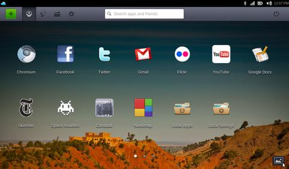

**[JoliCloud يصل إلى إصداره 1.1](https://www.it-scoop.com/2010/12/jolicloud-1-1/)**

كما يقول المثل الفرنسي : "أن تصل متأخرا خير من أن لا تصل نهائيا" (mieux vaut tard que jamais)، هذا هو الحال مع الإصدار 1.1 من نظام JoliCloud (أو تقريبا) و الذي تأخر صدوره عن موعده المحدد، لكن بالرغم من التغير الطفيف في الترقيم إلا أن ذلك لا يعكس الإضافات الجديدة و التحسينات في هذا الإصدار.

في مجمل ما تمت إضافته أو تحسينه في الإصدار 1.1 من نظام "السحابة الجميلة" نجد كلا من الانتقال إلى الإصدار 10.04 كقاعدة للنظام و إمكانية تخصيص الـ Dashboard و تغيير الخلفية، و تحسين أداء تسجيل الدخول عبر الـ Facebook.

كما تم تحسين كل من سرعة إقلاع النظام و دعم الفيديوهات Full HD 1080p و YouTube 720p (مع معالجات Atom N550)

الإصدار 1.1 من JoliCloud متوفر للتحميل من [هنا](http://www.jolicloud.com/download)، و من الممكن تجربته أيضا مباشرة على متصفح Chrome عبر [هذه الصفحة](http://my.jolicloud.com/)
