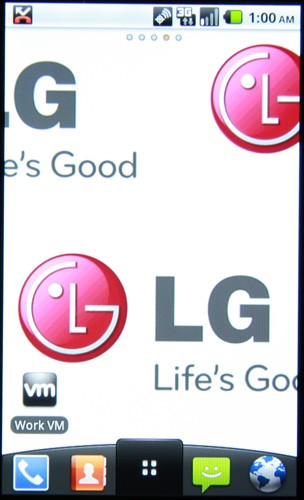

**[vmWare تعمل على توفير أنظمة Android وهمية على هواتف LG الذكية](https://www.it-scoop.com/2010/12/lg-vmware-android-virtualization)**

نشرت vmWare الرائدة في مجال الأنظمة الوهمية/الافتراضية [بيانا صحفيا](https://www.vmware.com/company/news/releases/vmware-lge-partnership.html) تعلن فيه أنها تعمل بمعية LG لتوفير أنظمية Android وهمية على هواتفها.

نعم، أنظمة وهمية (Virual machine)  على هاتف ذكي، حيث يصبح بإمكان مستخدمي هواتف LG التي تعمل على أنظمة Android العمل على نظامين منفصلين تماما في آن واحد، مثلا (مثلما هو موضح في الفيديو المرفقة أسفله) لاستعمال نفس الهاتف للاستعمال الشخصي، و للاستعمال المهني . فمثلا يمكن فصل أرقام الاتصال و جعل الأرقام المهنية في نظام و الأرقام الشخصية في نظام آخر.

نفس الأمر مع خدمات البريد و الخدمات الاجتماعية، حيث أنه يمكن (حسبما بينته الفيديو) فتح ملف صوتي في نظام و مواصلة العمل على النظام الآخر.

لم تفهم الفكرة جيدا؟ الفيديو التالية توضح مبدأ عمل الفكرة:

<!-- more -->

<object classid="clsid:D27CDB6E-AE6D-11cf-96B8-444553540000" width="437" id="viddler" height="370"><embed src="http://www.viddler.com/simple/b111baca/" width="437" height="370" allowscriptaccess="always" allowfullscreen="true" flashvars="fake=1"></embed></object>

لم يتم الإعلان عن موعد محدد لتوفير هذه الخدمة.
