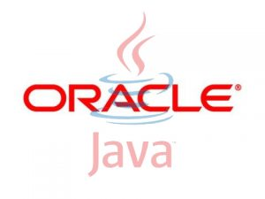

**[منظمة Apache تتنحى من مجتمع Java.](https://www.it-scoop.com/2010/12/apache-resigns-from-the-jcp-executive-committee)**

لا زلنا مع مسلسل Java/Oracle، يبدو أن عام محن Java لم ينقضي بعد، وإذا كنت تريد آخر حلقة فإليك هذا الخبر، هو خطب آخر جلل قد لحق مجتمع Java، فبعد أن تم الإقرار على مواصفات كل من Java7 و 8، قررت  منظمة Apache الانسحاب من اللجنة التنفيذية (Java Community Process (JCP، بسبب نزاع دار حول سياسة الرخص التي تنتهجها Oracle وبالتالي تضع حدا لمساهماتها في لغة Java .

هذه الحلقة الجديدة من المسلسل المؤلم، قد تولد ردود أفعال كثيرة من مجتمع المطورين، فقد أنهت Apache  بقرارها هذا، 10 سنوات من المساهمة في مشروع Java، وقد أرجعت ذلك لعدم احترام Oracle لطلب رفع قيودها على رخصة TCK) Java Technology Compatibility Kit) وعدم منحها لمشروع Harmony . هذا الأخير الذي أصبح مستقبله مجهولا، ولا أحد يدري هل ستستمر Apache  في العمل عليه.

القيود المفروضة من طرف مستحوذ شركة Sun، تمنع الاستعمال الصحيح لبرامج مفتوحة المصدر في منصات الهواتف النقالة .

Apache استنكرت أيضا تطبيع بعض أعضاء لجنة JCP وعدم استنكارهم لسلوكات Oracle على منصة الـ Java ومنهم HP، Ericsson،Fujitsu, VMware و Intel.

باختصار Apache ترفض التحكم المفرط لـ Oracle على Java الذي -حسبها- قد تجاوز الحدود المتفق عليها.

يمكن الاطلاع على إعلان Apache استقالتها من مجتمع Java من على مدونتها الرسمية [من هنا](http://blogs.apache.org/foundation/date/20101209).

- لن نقول ما هو مستقبل Java في ظل Oracle لأنه أصبح سؤالا تقليديا :p لكن:

كيف ترى عزيزي القارئ قرار Apache وموقفها من سياسة Oracle؟ هل يعزز هذا قضية Google مع Oracle ؟
