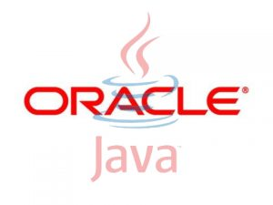

**[Oracle تدعو Apache للعودة من جديد إلى مجتمع Java]( https://www.it-scoop.com/2010/12/oracle-apache-jcp/)**

بعد أن هددت منظمة Apache بالخروج من الـ (Java Community Process (JCP إن تمت المصادقة على مواصفات Java 7 و 8 التي تقدمت بها Oracle، و بعد أن [بينت](https://www.it-scoop.com/2010/12/apache-resigns-from-the-jcp-executive-committee/) أنها لم تطلق هذه التهديدات مازحة و ذلك بتطليقها الفعلي لـ JCP  و هو ما لم يَسُر Oracle، يحاول عملاق قواعد البيانات أن رأب الصدع الحاصل في بيت Java بدعوتها "غريمتها" للعدول عن رأيها.

جاء ذلك في [تدوينة](http://blogs.oracle.com/henrik/2010/12/oracle_response_to_apache_departure_from_jcp.html) مقتضبة على مدونة Oracle تشير فيها إلى الدور الكبير الذي تلعبه Apache في معادلة Java و بفضلها عليها، و تدعوها إلى أن ترجع إلى المجتمع من جديد، لكنها لم تقدم أية تنازلات من جهتها.

و هو الأمر الذي دفع Jim Jagielski رئيس منظمة Apache إلى [التساؤل](http://twitter.com/jimjag/status/13013975717380096) "بتهكم" عن الأمر الذي قد يغير فعلا من رأي منظمته لترجع إلى الـ JCP و هو الذي يراها قد أفرغت من محتواها بعد أن "قتلتها" Oracle مثلما أشار إليه في [مدونته](http://www.jimjag.com/imo/index.php?/archives/242-The-JCP-Is-Dead.html) الشخصية في مقال عنونه " The JCP Is Dead... and Oracle killed it."، داعيا –و لو بطريقة غير مباشرة- إلى إنشاء مجتمع جديد للغة يكون مستقلا عن أية هيمنة أو نفوذ، لمواصلة تطوير اللغة فيه.

السؤال الذي يطرح نفسه هو: هل سنشهد قريبا ولادة لمجتمع جديد يقوم على أنقاض الـ JCP ؟ و هل يقدر أن يفرض نفسه في ظل هيمنة Oracle على اللغة ؟
