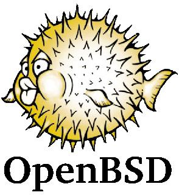

**[أنباء عن دس الـ FBI للعديد من الـ Backdoors في نظام OpenBSD "الآمن"](https://www.it-scoop.com/2010/12/fbi-backdoors-openbsd)**

كشف Theo de Raadt أحد أهم مطوري نظام OpenBSD  عن محتوى [رسالة](http://marc.info/?l=openbsd-tech&m=129236621626462&w=2) أرسلها له Gregory Perry أحد المستشارين الأمنيين السابقين لدى الحكومة الأمريكية و التي جاء فيها أن الـ FBI عمل على نشر أكثر من Backdoors في نظام OpenBSD لأغراض تجسسية.

حسب Gregory Perry فإن الـ FBI عمدت منذ 10 سنين خلت إلى توظيف مبرمجين لكتابة هذه الـ Backdoors في طبقة [IPSEC](http://en.wikipedia.org/wiki/IPsec) الأمنية الخاصة بنظام OpneBSD المعروف بأمانه.

و يعود عدم كشف الأمر إلى بعد مرور 10 سنوات إلى توقيع Gregory Perry لمعاهدة عدم الكشف عن الأسرار مع الـ FBI و التي كانت مدتها 10 سنوات.

حاليا لا يوجد أي إثبات عن صحة ما جاء في الرسالة من عدمه، لكن الأمر قد يدفع إلى مراجعة الشفرة المصدرية لطبقة IPSEC رغم أنها عرفت تطورات كثيرة طيلة 10 سنوات كاملة.

في رأيك، إذا ثبت وجود هذه الـ Backdoors هل سيغير ذلك من نظرة الجميع إلى أن الأنظمة مفتوحة المصدر أكثر أمنا من غيرها ؟

شكر خاص لخالد الشقروني لإرساله الخبر
