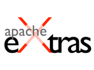

**[Google تدعم وبقوة منظمة Apache !](https://www.it-scoop.com/2010/12/google-to-supports-apache-foundation)**

يبدو أن هناك موجة سخاء وعطف كبيرة تمر بها Google ( أو ربما كثر عليها المال؟ :p)، فبعد[ هديتها لـ Eclipse Foundation بمنحها تطبيقين بقيمة 5 ملايين دولار](https://www.it-scoop.com/2010/12/google-eclipse-foundation-windowbuilder-pro-codepro-profile/)، تلتفت هذه المرة إلى Apache Foundation، بباقة زهور لتدعمها بـ Apache Extras، لفهرسة المشاريع مفتوحة المصدر التي تستخدم تقنيات وأدوات Apache Software Foundation.

حسب آخر [إحصائيات Netcraft ](http://news.netcraft.com/archives/category/web-server-survey/)فإن Apache هو خادم الويب الأكثر استعمالا بما نسبته 59,35 % بغض النظر عن حصة خوادم Google المشتقة من Apache والتي نسبتها 5,85 % حول العالم،  كما تملك Apache عددا كبيرا من الحلول البرمجية أصبحت مؤخرا كثيفة الاستعمال .

ولهذا أرادت Google -رد الجميل- تسليط الضوء على منتجات Apache بفتح موقع [apache-extras.org](http://code.google.com/a/apache-extras.org/hosting/) الذي يسمح بإجراء عمليات بحث عن المشاريع التي تعتمد أدوات Apache، حاليا الموقع لا يفهرس سوي بضع وستون مشروعا، لكنها تدعو المطورين للمساهمة في إثراء هذا المحرك بإضافة مشاريعهم على شرط أن  يكون المشروع ذو رخصة مفتوحة المصدر، وبالنسبة لمن مشاريعهم مسكنة مسبقا على Google Code يمكنهم طلب نقل المشروع إلى Apache Extras.

نفس الشيء قامت به Google شهر مايو الفارط حين أطلقت Eclipse Labs لفهرسة المشاريع المرتبطة بـ Eclipse، واليوم هو يفهرس 1500 مشروع!.

- هل نحسن الظن بالأخ Google؟ أم نقطعه تقطيعا بـ"مالذي تريد Google جنيه من هذا؟" :p ؟
