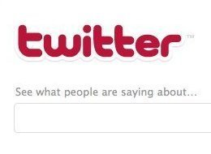

[الصين تطلق Red Twitter !](https://www.it-scoop.com/2010/12/china-launches-red-twitter/)

حسب ما أشارت إليه [صحيفة The telegraph](http://www.telegraph.co.uk/news/worldnews/asia/china/8203593/China-launches-Red-Twitter.html)، أطلقت الصين منصة تدوين مصغرة مشابهة لـ Twitter، لكن عكس هذا الأخير الذي يتميز بحرية التعبير، فإن النسخة الحمراء الصينية منه وكخطوة أولى لهيمنة الحكومة على الإعلام الجديد، ستدندن حول ترويج الشيوعية، الروح الثورية، وأقوال Chairman Mao وتمجيد مناقبه  وغيرها من الحكم والأفكار الفلسفية لـ"رفع الهمة".

ومن أمثلة بعض الاقتباسات التي تم عرضها على الصفحة الرئيسية:

<blockquote>

> 
> اعمل بجد، كن صادقا، وعامل الناس بحُسن
> 
> 
</blockquote>

<blockquote>حقا أحب هذه الكلمات من Chairman Mao: "العالم عالمنا، علينا أن نتحد في العمل"</blockquote>

<blockquote>أولئك الإمعة لا تزال تأخذهم الأمواج يتصاعدون فيها وينزلون، فقط من يواجهون الرياح ولا يهابون العقبات يصلون بسرعة إلى الجهة الأخرى.</blockquote>

ومن جهة أخرى :p أعلنت [Mashable](http://mashable.com/2010/12/15/chinas-communist-twitter/) أن الموقع في أول يوم له تعرض لخلل تقني حال دون تسجيل أعضاء جدد ، وبالطبع سيخضع مستعملوه إلى الرقابة التامة، لكن ليس قبل أن يتم حل مشكل صعوبة التسجل:).

- هل تحاول الصين تحويل التدفق العالي لموقع Twitter الذي تصعب السيطرة عليه إلى Twitter آخر واضح المعالم والحدود وقابل للمراقبة التامة؟

- أم أنه لم يكفي Twitter الأزرق، وكان لزاما إطلاق صديقه الأحمر؟

- هل سنرى Twitter أسود :p؟
