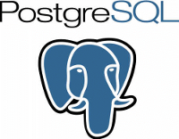

**[جملة تحديثات جديدة لقواعد البيانات PostgreSQL](https://www.it-scoop.com/2010/12/postgresql-updates-released/)**

[أعلنت](http://www.postgresql.org/about/news.1270) The PostgreSQL Global Development Group المنظمة المسؤولة عن قواعد بيانات  PostgreSQL ، عن طرحها لجملة من التحديثات تخص الفروع الناشطة من قواعد بياناتها 9.0.2، 8.4.6، 8.3.13،  8.2.19 والتحديث الأخير بالنسبة للفرع 8.1.23 . ناصحة من لا يزال يستعمل هذا الأخير أن يرتقي لفروع أحدث في أقرب وقت.

تأتي هذه التحديثات بإصلاحات لأكثر من 170 علة بالنسبة للإصدارة 8.1.23 عولجت فيها مشاكل متعلقة بتسربات في الذاكرة، وضع التأهب standby ووظائف المضاعفة replication functions. كما استبدلت طريقة النسخ الاحتياطي تحت نظام Linux من [write ahead logs](http://www.postgresql.org/docs/9.0/interactive/wal-intro.html) إلى _[fdatasync](http://pubs.opengroup.org/onlinepubs/007908799/xsh/fdatasync.html)_ . لكن لا يوجد أي إصلاح متعلق بالأمن! .

باقي الملاحظات وما يخص الإصدارات الأخرى تجدونها [هنا](http://www.postgresql.org/docs/9.0/static/release.html)ـ

الحزم التنفيذية متوفرة للتحميل المجاني لأغلب أنظمة التشغيل،[من هنا](http://www.postgresql.org/download/).

- هل تستعمل قواعد البيانات PostgreSQL؟ وإذا كانت الإجابة بلا، فهل تخشى تقلبات Oracle على MySQL ويدفعك ذلك إلى التخمين في البدائل الحرة مثل PostgreSQL ؟
