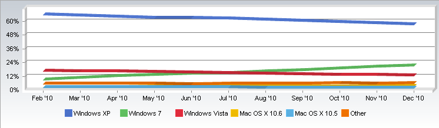

**[Windows 7 يتجاوز حاجز 20% من سوق أنظمة التشغيل العالمي](https://www.it-scoop.com/2011/01/windows-7-20-percent-market-share)**

كشفت إحصائيات NetApplications لشهر ديسمبر المنصرم، أن نظام Windows 7 يتجاوز حاجز 20% من سوق أنظمة التشغيل العالمي (20.87% على وجه التحديد)، فيما تراجع نظام Vista بـ 0.51%.

و حسب هذه الإحصائيات يبقى نظام Windows XP في الصدارة مسجلا نسبة 56.72% بالرغم من تراجعه بـ 1.16%، فيما سجل نظام Mac OS X 10.6 نسبة 3.05% تلاه OS X 10.5 بـ 1.46%.

في نفس السياق تشير إحصائيات كل من [w3counter](http://www.w3counter.com/globalstats.php) و [statcounter](http://gs.statcounter.com/#os-ww-monthly-201001-201012) إلى أن حصة Windows 7 أكبر بذلك بكثير، حيث يحدد [w3counter](http://www.w3counter.com/globalstats.php) حصة Windows 7 بـ 24.12% خلال شهر نوفمبر فيما يشير [statcounter](http://gs.statcounter.com/#os-ww-monthly-201001-201012) أن حصة هذا النظام قد تجاوزت 25% (25.86% على وجه التحديد) خلال شهر ديسمبر.
