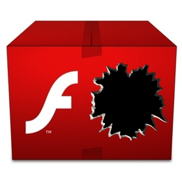

**[باحث أمني يتوصل إلى طريقة لتجاوز الـ Sandbox الخاص بـ Flash Player](https://www.it-scoop.com/2011/01/bypassing-flash-local-with-filesystem)**

نشر الباحث الأمني Billy Rios على [مدونته](http://xs-sniper.com/blog/2011/01/04/bypassing-flash%E2%80%99s-local-with-filesystem-sandbox/) [POC](http://en.wikipedia.org/wiki/Proof_of_concept))  Proof of Concept) لإمكانية تجاوز حماية الـ Sandbox التي أضافتها Adobe لقارئها Flash Player.

و حسب الطريقة التي شرحها Rios فإنه يمكن لأي ملف SWF يتم تنفيذه مباشرة على الجهاز (و ليس من خلال المتصفح) أن يقرأ ملفات الجهاز مباشرة، و يقوم بإرسالها عبر الشبكة دون أن يثير انتباه الضحية، متجاوزا بذلك حماية الـ Sandbox التي من المفترض أن تمنع أيا من سرقات البيانات الشخصية.

من جهتها قللت Adobe من خطورة الثغرة ، حيث أعلنت على  لسان أحد متحدثيها الرسميين أنها اطلعت على تدوينة Billy Rios لكن الثغرة ليست بالخطورة التي تبدو عليها، و تعلل ذلك بأن الشروط الملائمة لتنفيذ المراحل التي شرحها Rios صعبة التوفير، حيث يجب أولا على المخترق وضع ملف SWF على جهاز الضحية ثم إقناعه بتشغيله.

تجدر الإشارة إلى أن  Adobe ليست الوحيدة التي تهتم بمستويات الأمان في الـ Flash Player، حيث سبق لها و أن عملت جنبا إلى جنب مع Google لتعزيز أمن قارئ الوسائط المتعددة الخاص بها، حيث سبق و أن أطلقت Google منذ أقل من شهر الإصدار Beta من Chrome 9 و الذي من بين خصائصه عزل Flash Player داخل Sandbox.
