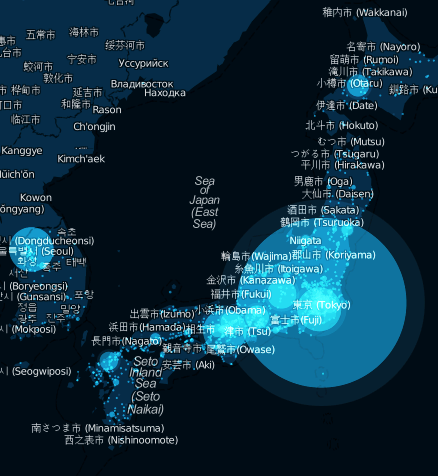

**[عندما يحطم اليابانيون رقمهم القياسي بإرسالهم لما معدله 6939 تغريدة في الثانية](https://www.it-scoop.com/2011/01/japan-new-tweet-record/)**

نشرت Twitter على مدونتها الرسمية [تدوينة](http://blog.twitter.com/2011/01/celebrating-new-year-with-new-tweet.html) بخصوص  استعمال لشبكة التغريد المصغر في احتفاليات رأس السنة في مختلف أنحاء العالم، و تشير هذه التدوينة إلى أن اليابانيين قد تمكنوا من تحطيم الرقم القياسي السابق الذي كان بحوزتهم بإرسالهم لما معدله  6939 تغريدة في الثانية.

و حدث ذلك أربع ثواني فقط بعد أن أعلنت الساعة تمام منتصف الليل في بلاد الشمس المشرقة، و يخلف اليابانيون أنفسهم في صدارة الأرقام القياسية على Twitter حيث كان الرقم القياسي السابق الذي بحوزتهم هو 3283 تغريدة في الثانية و الذي سجلوه بعيد فوز فريقهم الوطني على فريق الدانيمارك في نهائيات كأس العالم 2010 التي أقيمت في جنوب إفريقيا.

لم يكن اليابانيون وحدهم من استعمل Twitter خلال تلك الفترة، و تشير الفيديو التالية إلى الإقبال الذي عرفته شبكة العصفور الأزرق (الذي يتحول بين الحين و الآخر إلى حوت أزرق كبير :p) خلال نفس الفترة:

<!-- more -->

<object classid="clsid:d27cdb6e-ae6d-11cf-96b8-444553540000" width="400" codebase="http://download.macromedia.com/pub/shockwave/cabs/flash/swflash.cab#version=6,0,40,0" height="201"><embed src="http://www.flickr.com/apps/video/stewart.swf?v=71377" bgcolor="#000000" height="201" width="400" allowfullscreen="true" type="application/x-shockwave-flash" flashvars="intl_lang=fr-fr&photo_secret=f1c75607f0&photo_id=5330386295"></embed></object>
