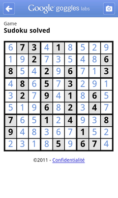

**[Google Goggles ليس مجرد تطبيق للبحث المرئي و إنما أداة لحل للـ Sudoku أيضا](https://www.it-scoop.com/2011/01/google-goggles-sudoku/)**

أطلقت Google اليوم التحديث 1.3  لتطبيقها Google Goggles على هواتف Android و iPhone و الذي أضافت إليه العديد من التحسينات التي تجعل التطبيق أفضل بكثير.

من بين هذه التحسينات نجد قراءة الـ barcode و الـ QR code  بسرعة فائقة، و تعرفه على الإعلانات المطبوعة، لكن الإضافة التي ستسيل الكثير من الحبر هي خاصية حل جداول لعبة Sudoku بسرعة كبيرة.

الفيديو التالية تبين كيف سابق Google Goggles أحد أمهر لاعبي Sudoku و كيف يتمكن من إنهاء اللعبة قبله.

<!-- more -->

<object classid="clsid:d27cdb6e-ae6d-11cf-96b8-444553540000" width="640" codebase="http://download.macromedia.com/pub/shockwave/cabs/flash/swflash.cab#version=6,0,40,0" height="385"><embed width="640" allowfullscreen="true" src="http://www.youtube.com/v/rdftOloAH9Q?fs=1&hl=fr_FR&color1=0x5d1719&color2=0xcd311b" type="application/x-shockwave-flash" height="385"></embed></object>

الإصدار 1.3 من Google Goggles متوفر للتحميل من على الـ AppStore و Android Market و يمكن الوصول إليها عبر [هذه الصفحة](http://www.google.com/mobile/goggles/)
