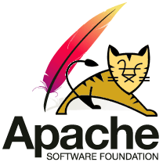

**[الإصدار النهائي من Tomcat 7 خادم تطبيقات Java الشهير متوفر للتحميل](https://www.it-scoop.com/2011/01/apache-tomcat-7/)**

أطلق فريق عمل Tomcat   خادم تطيبقات Java الشهير الإصدار 7.0.6  منه و هذا بعد عدة إصدارات Beta التي نشرت منذ أبريل الماضي.

يدعم هذا الإصدار كلا من الـ [JSP](http://en.wikipedia.org/wiki/JavaServer_Pages) في إصداره 2.2 و الـ [servlet](http://en.wikipedia.org/wiki/Servlets) في إصداره 3.0، و يسمح استعمال هذا الإصدار من servlet لـ Tomcat 7 بتسهيل المهمة على المطورين، و خصوصا ما تعلق بإدارة الإعدادات، حيث تم استبدال استعمال ملف web.xml مركزي لجميع الإعدادات بجملة ملفات متفرقة تختلف باختلاف الآلية التي تديرها. كما يسمح هذا الإصدار إدارة متقدمة للـ Cookies و دعما للـ asynchronous threads.

كما يرقع هذا الإصدار العديد من العلل المكتشفة في الإصدارات السابقة كعلل تسربات الذاكرة، إضافة إلى جملة من الثغرات الأمنية.

Tomcat 7.0.6 متوفر للتحميل من [هنا](http://tomcat.apache.org/download-70.cgi)
