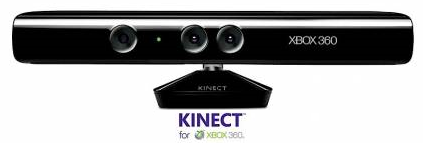

**[أنباء عن تحضير Microsoft لـ SDK رسمي للـ Kinect على أنظمة Windows](https://www.it-scoop.com/2011/01/microsoft-official-kinect-sdk-windows)**

أشار موقع Winrumors إلى أن Microsoft قد تكون[ قد بدأت التحضير](http://www.winrumors.com/microsoft-preparing-official-kinect-drivers-and-sdk-for-windows/) لإصدار SDK رسمي لاستعمال جهاز Kinect على أنظمة Windows بعد أن كان من المفترض به استخدامه على أجهزة Xbox 360 فقط.

و قد تكون Microsoft أدركت أن نجاح Kinect  -والذي يتمثل في بيع 8 ملايين قطعة خلال شهرين فقط- لا يعود إلى استعماله كأداة طرفية على Xbox 360 فحسب و إنما لعبت الاستعمالات "غير الرسمية" له دورا كبيرا في الترويج له.

حيث شهدت الشبكة العنكبوتية عدة تطبيقات على أنظمة التشغيل الثلاث الرئيسية و التي تعددت استعمالاتها و وصل الأمر بـ "مخترقي" الجهاز إلى استعماله في المجال الطبي أيضا.

في رأيك هل تأخرت Microsoft في إطلاق SDK رسمي لـ Kinect ؟ و هل تتوقع زيادة في المبيعات لو قامت فعلا بإنتاجه ؟

ما هي المجالات التي تتوقع أن يتم استخدام الـ Kinect فيها ؟
