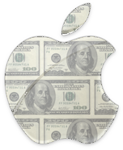

**[Apple تسجل أرباحا قياسية خلال الربع المالي الأول من العام الجاري و تبيع 15 مليون iPad](https://www.it-scoop.com/2011/01/apple-first-quarter-results/)**

حتى أكثر المحللين تفاؤلا لم يكونوا يتوقعون النتائج التي [سجلتها](http://www.apple.com/pr/library/2011/01/18results.html) Apple خلال الربع المالي الأول من العام الجاري حيث سجلت شركة التفاحة المقضومة رقم أعمال مقدر بـ 26.7 مليار دولار و فائدة صافية مقدرة بـ 6 ملايير دولار.

و يعود الفضل في هذه النتائج إلى منتجات iOS حيث استطاعت Apple بيع 16.24 مليون iPhone و 7.33  مليون iPad خلال هذا الربع الأول و بذلك تصل مبيعات الـ iPad إلى أكثر من 15 مليون قطعة منذ إطلاقه.

كما شهدت مبيعات Mac تقدما قدره 23% ووصلت مبيعاته إلى 4.13 مليون جهاز، في حين تراجعت مبيعات الـ iPod بحوالي  7%.
