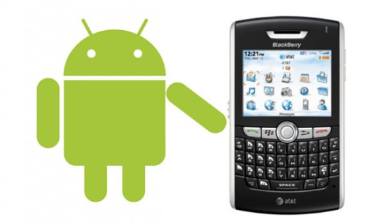

**[هل ستدعم RIM تطبيقات Android على الـ Playbook و الـ BlackBerry ؟](https://www.it-scoop.com/2011/01/rim-android-apps-playbook-blackberry/)**

[أشار](http://www.bgr.com/2011/01/26/exclusive-blackberry-playbook-and-smartphones-to-run-android-apps/) موقع Boy Genius Report استنادا إلى مصادر "جد موثوقة" أن Research In Motion تفكر جديا في دعم تطبيقات Android على هواتفها BlackBerry و جهازها اللوحي القادم PlayBook.

و حسب هذا الموقع فإن RIM تسعى إلى توفير آلة Java وهمية Java Virtual Machine لتعمل على نظام QNX الخاص بجهازها اللوحي PlayBook مما سيسمح بتشغيل تطبيقات Android، و قد يتم ذلك –حسب نفس الموقع دائما- بإحدى الطريقتين التاليتين: إما أن تقوم RIM بدعم الآلة الافتراضية Dalvik  مفتوحة المصدر مباشرة على أنظمتها، أو أنها ستلجأ إلى توقيع عقد مع Google لجعل Dalvik متوافقا معها و لتوفير دعم رسمي لها.

السؤال الذي يطرح نفسه الآن ليس في إمكانية القيام بذلك من الناحية التقنية، بل من الناحية القانونية، حيث أن فصول مسلسل Google/Oracle بخصوص الملكية الفكرية لـ Android لم تنته بعد، و آخر فصولها هو هذا الخبر الذي يشير إلى [أنه لا أكواد Java منسوخة ولا أسلحة دمار شامل وُجدت على Android :) ](https://www.it-scoop.com/2011/01/java-android-google-oracle-whats-going-on/http:/www.it-scoop.com/2011/01/java-android-google-oracle-whats-going-on/)

-   في رأيك هل ستفعلها RIM فعلا و تدعم تطبيقات Android؟ و هل سيعود ذلك سلبا أو إيجابا على كل من Google، RIM و Apple ؟
