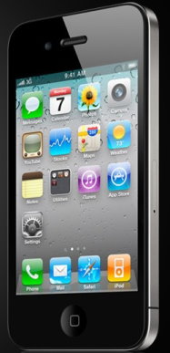

**[أنباء عن نية Apple إطلاق هاتف iPhone أصغر و أرخص و من دون اشتراك إجباري](https://www.it-scoop.com/2011/02/apple-smaller-cheaper-iphone/)**

نشرت وكالة  Bloomberg [خبرا](http://www.bloomberg.com/news/2011-02-10/apple-said-to-work-on-cheaper-more-versatile-iphone-models.html) مفاده أن Apple تعمل حاليا على إنتاج جهاز iPhone أصغر و أرخص من الـ iPhone 4 و لا يتطلب اشتراكا إجباريا للحصول عليه.

و حسب هذا الخبر -الذي يستند إلى مصادر داخلية لـ Apple - أن هدف شركة التفاحة المقضومة من وراء هذه الخطوة هو محاولتها لمنافسة نظام Android الذي بدأ ببسط سيطرته على الهواتف متوسطة الكفاءة إضافة إلى استباق أية خطوات لـ Nokia في هذا النوع من الهواتف خاصة مع شراكتها مع Microsoft و استخدام نظام Windows Phone 7 على أجهزتها.

كما تشير Bloomberg إلى أن أحد موظفي Apple يشير إلى أن الجهاز القادم سيحتوي بشكل كبير على نفس مكونات جهاز iPhone 4 و  سيكون أصغر منه بحوالي الربع ، كما أنه لن يحتوي على زر Home الوحيد الذي تملكه شاشات iPhone الحالية،و   سيكون سعره في حدود 200 دولار فقط.

هل أصبحت  Apple خائفة من سيطرة Android ؟
