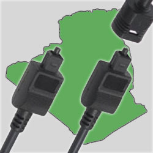

**[لا الإنترنت و لا الشبكات الاجتماعية مقطوعة في الجزائر](https://www.it-scoop.com/2011/02/algeria-internet-is-not-down-nor-are-social-networks/)**

فاجئني [خبر](http://mashable.com/2011/02/12/algeria-facebook-shutdown-2/) نشرته Mashable منذ ساعات تشير فيه إلى أن الجزائر قد لجأت إلى قطع الإنترنت و الشبكات الاجتماعية و الذي كان عنوانه في البداية " Algeria's Internet, Facebook Shut Down As Unrest Intensifies" قبل أن يحدَّث، و أرى أنه من الأفضل أن أشير إلى أن الخبر لا أساس له من الصحة.

صحيح أن الإنترنت بطيء نوعا ما في الأيام القليلة الماضية، لكن الأمر أصبح شبه مألوف، فتدفق الإنترنت في مد و جزر مستمر. و لقد تتبعت أكثر جزائري على Twitter  و الـ Facebook و الكل يقوم بإضافة تحديثات، مما يشير إلى أن الأمر لا يشمل منطقة بعينها و إنما يخص مختلف أنحاء الجزائر.

على كل حال إن تم قطع الإنترنت أو الشبكات الاجتماعية ، و هو أمر غير متوقع خاصة بعد [تصريح](http://www.letempsdz.com/content/view/52562/1/) وزير الاتصال موسى بن حمادي لجريدة Le temps الناطقة باللغة الفرنسية أن الإنترنت في الجزائر لا يخضع لأية رقابة.
