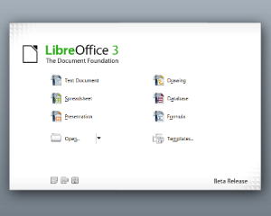

[**إطلاق الإصدار 3.3.1 من الحزمة المكتبية LibreOffice**
](https://www.it-scoop.com/2011/02/libreoffice-3-3-1/)

**[أعلنت ](http://blog.documentfoundation.org/2011/02/23/libreoffice-3-3-1-brings-new-colored-icons/)**The Document Foundation عن توفير LibreOffice 3.3.1  أول تحديث منذ [إطلاق ](https://www.it-scoop.com/2011/01/libreoffice-3-3/)الإصدار 3.3 (أول إصدار لـ LibreOffice)

بما أن الإصدار مجرد تحديث فقط (لاحظ الترقيم) فإن الجديد لا يعدو كونه تحسينا لاستقرار البرنامج و القضاء على الانهيارات التي تصيبه. و قد تم توفيرأيقونات جديدة ملونة  مبنية على  مواصفات الـ  The Document Foundation  (مثلما تبينه هذه [الصورة](https://2.bp.blogspot.com/_9MZR46ZEuS8/TURcR5CLQPI/AAAAAAAAAuA/6gLZ8h2RS9Y/s1600/RevisedIcons128px.png ) )

للتذكير فإن LibreOffice عبارة عن Fork للحزمة المكتبية OpenOffice.org جاءت ردا على المساهدمين فيه لسياسة Oracle التي تنتهجها لإدارة حزمتها المكتبية و التي أصبحت ملكا لها بعد شرائها لـ Sun المالكة الأصلية للحزمة.

LibreOffice 3.3.1 متوفر للتحميل من [هنا](http://www.libreoffice.org/download/).

