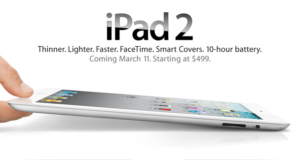
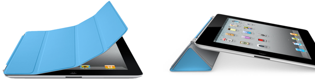

[**Apple تكشف عن الـ iPad 2 أنحف، أسرع و أخف من الـ iPad 1.**](https://www.it-scoop.com/2011/03/ipad-2/)

كشفت Apple اليوم عن الجيل الجديد من أجهزتها اللوحية iPad 2  أنحف أسرع و أخف من الجيل الأول من الـ iPad.

المفاجئ في الإعلان عن الـ iPad 2 هو أن ما جاء به لم يكن مفاجئا :) حيث تسربت معلومات كثيرة حول أهم خصائصه و التي من أهمها:

	  * نفس حجم الـ iPad 1 المقدر بـ 24.1x 18.5 سم و بشاشة 9.7 بوصة
	  * سمك 8.8 ملم (أنحف بـ 33% من الجيل الأول)
	  * وزن مقدر بـ 601 جرام (أخف من الجيل الأول)
	  * سعة تخزين متفاوتة ما بين 16 و 64 Gb.
	  * معالج A5 ثنائي الأنوية ذي تردد 1 Ghz إلى جانب معالج رسومي أسرع بـ 9 مرات.
	  * كاميرتين أمامية و خلفية.

كما تم الكشف عن iPad Smart Cover الغطاء المغناطيسي الذي يحمي الشاشة لدى حمل الجهاز، و الذي يمكن استعماله كوسيلة لإسناد الجهاز.

سيتم تسويق أجهزة الـ iPad 2 بنفس سعر الـ iPad الحالي ابتداء من 499 $ لا غير :p

