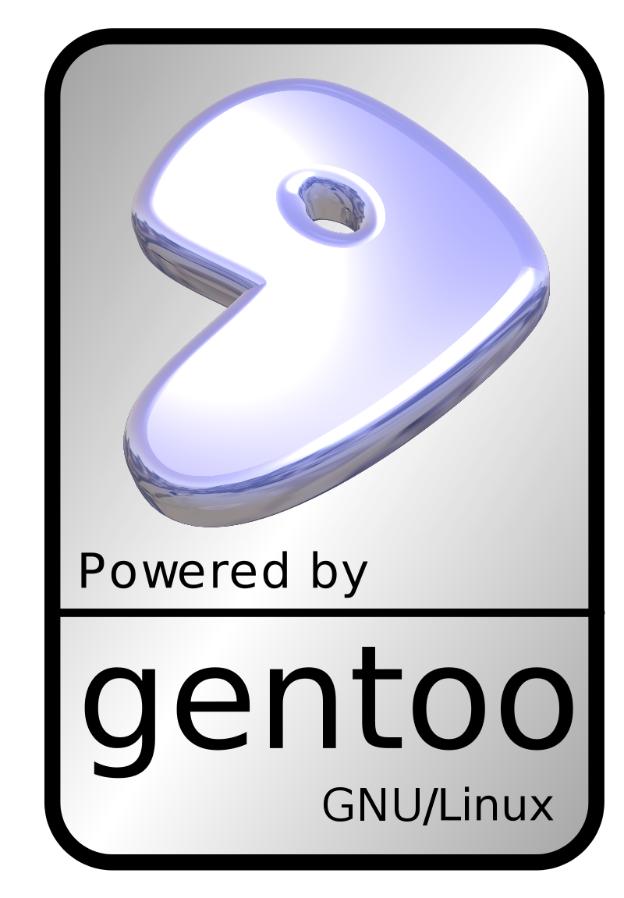

[**إطلاق  Gentoo Linux 11.0**
](https://www.it-scoop.com/2011/03/gentoo-linux-11-0/ )

[أعلن](http://www.gentoo.org/news/20110308-livedvd.xml) فريق Gentoo عن إطلاق الإصدار 11 من  Gentoo Linux   بأحدث الحزم مع تنويع في أسطح المكتب .

بعض من مزايا هذا الإصدار :

· النواة : Linux Kernel 2.6.37

· أسطح المكتب : KDE SC 4.6, GNOME 2.32, Xfce 4.8, , Openbox 3.4.11.2, Fluxbox 1.3.1 ...

· البرامج المكتبية ، الرسومية و الإنتاجية : OpenOffice 3.2.1, XEmacs 21.5.29 gVim 7.3.102, Abiword 2.8.6, GnuCash 2.2.9, GIMP 2.6.11, Inkscape 0.48.1, Blender 2.49b, XSane 0.997  ...

·  المتصفحات : Mozilla Firefox 3.6.13, Arora 0.11.0, Opera 11.0,Seamonkey 2.0.11  ...

· أدوات التواصل  : Pidgin 2.7.10, Quassel 0.7.1, Mozilla Thunderbird 3.1.7, Claws Mail 3.7.8, Qtwitter 0.10.0  ...

· تطوير التطبيقات : KDevelop 4.2, KDESvn 1.5.5, qt-creator 2.1.0, Bluefish 2.0.2 ..

· تطبيقات الـ Multimedia ـ: Amarok 2.4, MPlayer 1.0_rc4, DVDAuthor 0.6.14, LAME 3.98.4, ffmpeg 0.6, GNOME-MPlayer 1.0.0, SMPlayer 0.6.9  ...

لتحميل الـ  LiveDVD Gentoo Linux 11.0 ـ x86 [هنا](http://bouncer.gentoo.org/fetch/gentoo-11.0-livedvd/x86/) ـ amd64 [هنا](http://bouncer.gentoo.org/fetch/gentoo-11.0-livedvd/amd64/)

هل تستخدم Gentoo ؟ ما رأيك بهذا الإصدار ؟
