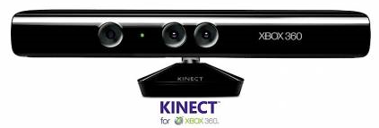

[**Microsoft تحطم رقما قياسيا ببيعها 10 ملايين جهاز Kinect و تزيح Apple من الصدارة**](https://www.it-scoop.com/2011/03/kinect-sales-top-10-million‎/)

ليست Apple وحدها التي تستطيع تحقيق مبيعات قياسية خلال أشهر قليلة، بل لم تعد متربعة على رأس تلك القائمة، حيث أزاحتها Microsoft بعد أن تمكنت من بيع 10 ملايين وحدة من جهاز الاستشعار Kinect خلال أربعة أشهر.

"أرقام المبيعات تتحدث عن نفسها، حيث أنه لم يسبق لأي منتج الكتروني أن تم بيعه بشكل أسرع من خلال 60 يوم" حسبما [صرح](http://community.guinnessworldrecords.com/_Kinect-Confirmed-As-Fastest-Selling-Consumer-Electronics-Device/blog/3376939/7691.html) به Gaz Deaves مسؤول قسم الألعاب لكتاب Guiness للأرقام القياسية في تعليق له على تحطيم لهذا الرقم القياسي. حيث تمكنت Microsoft من بيع ما معدله 133333 وحدة Kinect يوميا بمجموع 8 ملايين وحدة في الفترة الممتدة ما بين  4 نوفمبر 2010 و 3 يناير 2011.

و لقد شهد استعمال Kinect في مجالات كثيرة لا تمت للألعاب بأية صلة، منها استعماله في المجال الطبي، كما تم إصدار [حزم تطويرية غير رسمية له](https://www.it-scoop.com/2010/11/microsoft-kinect-xbox-360-hacked/) على أنظمة التشغيل المختلفة، في حين أشارت بعض المصادر إلى قرب [إطلاق](https://www.it-scoop.com/2011/01/microsoft-official-kinect-sdk-windows/) Microsoft لـ SDK رسمي لجهاز الاستشعار يعمل على نظام Windows.

في رأيك هل ستستعيد Apple الصدارة من جديد مع الـ iPad2 ؟

