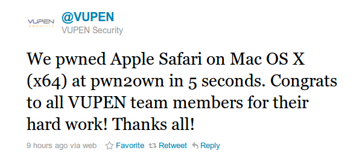
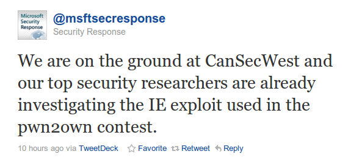

[**مسابقة Pwn2Own : متصفح  Safari يسقط خلال 5 ثواني، Chrome يصمد و Firefox يسخن للدخول إلى الحلبة**](https://www.it-scoop.com/2011/03/pwn2own-safari-5-seconds/)

5 ثواني فقط، هي المدة التي احتاجها فريق VUPEN الفرنسي [ليطيح](http://twitter.com/VUPEN/status/45665151776600064) برأس Safari و يفوز بجائزة 15 ألف دولار و بجهاز MacBook Air الذي اخترقوه. و يتعلق الأمر بالإصدار 5.0.3  من المتصفح.

و لم يحتج فريق VUPEN سوى إلى أن يفتح المتصفح صفحة ملغمة معدة خصيصا للحدث و التي تجعله يفتح الآلة الحاسبة التي تقوم بدورها بكتابة ملف على القرص الصلب و من ثم تنفيذ الاستغلال، كل هذا من دون أن يحدث أي انهيار للمتصفح.

و لم يلبث أن سقط Internet Explorer 8 بعده على يد Stephen Fewer العامل لدى Harmony Security و الذي استطاع بفضل استغلاله لثلاث ثغرات أن يتحكم عن بعد في المتصفح ثم في نظام  Windows 7 SP1  64 bits  الذي يستضيفه. لكن بالرغم المدة القصيرة التي استغرقها  Fewer للقيام بذلك، إلا أن ذلك كلفه  6 أسابيع من التحضير.

و لقد سارعت Micrsosoft [للإعلان](http://twitter.com/msftsecresponse/status/45646985998516224) أنها بدأت فعليا في التحقيق في الثغرة المستغلة خلال مسابقة  Pwn2Ownو العمل على توفير ترقيع لها

أما البطل للسنة الثانية على التوالي فهو من دون شك متصفح Chrome الذي لم يسجل في مسابقة اختراقه سوى باحث أمني واحد و الذي فضل عدم تجربة حظه (ربما لأنه يعرف أن النتيجة محسومة سلفا).

و يشهد اليوم دخول متصفح Firefox حلبة المسابقة إلى جانب أنظمة تشغيل الهواتف الذكية iOS، Windows Phone 7 ، Android   و BlackBerry.

تجدر الإشارة إلى أنه لا يتم  استخدام أحدث إصدارات المتصفحات مثلما [صرح ](http://www.computerworld.com/s/article/9214002/Safari_IE_hacked_first_at_Pwn2Own )به Peter Vreugdenhil العامل لدى TippingPoint  ، و إنما تم تحديد الإصدارات المشاركة منذ أسبوعين و ذلك لتمكين المشاركين من تحضير استغلالات ثغراتهم بشكل أفضل.

