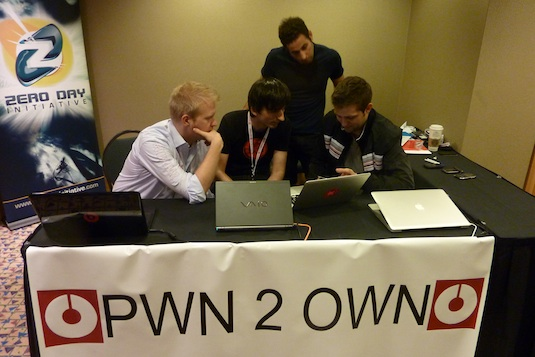
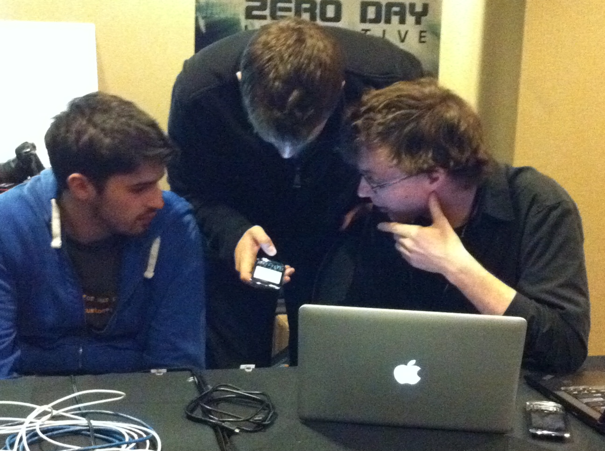

[**Pwn2Own: سقوط الـ iPhone 4 و الـ BlackBerry و لا أحد يحاول اختراق Android أو Windows Phone 7**](https://www.it-scoop.com/2011/03/pwn2own-iphone-4-blackberry/)

شهد اليوم الثاني لمسابقة Pwn2Own دخول الهواتف الذكية إلى الحلبة، و التي شهدت سقوط كل من الـ iPhone 4 و الـ BlackBerry في حين خلت ساحتا Android و Windows Phone 7 من المنافسين.

فيما يخص الـ Blackberry Torch 9800 المجهز بنظام Blackberry 6 OS فلقد سقط على يد [فريق مكون من 3 خبراء أمنيين](http://www.zdnet.com/blog/security/pwn2own-2011-blackberry-falls-to-webkit-browser-attack/8401) و الذي استطاعوا استغلال ثغرات في الـ WebKit للإيقاع بضحيتهم. و بالرغم من أن أنظمة أمان Blackberry 6 OS ليست بالمتقدمة، إلا أن نقص المعلومات عنها صعب من مهمة الفريق.

[caption id="" align="aligncenter" width="467" caption="الثلاثي الذي اخترق جهاز Blackberry Torch 9800"][/caption]

أما الـ iPhone 4 المجهز بنظام iOS 4.2.1 [فلقد كان من نصيب Charlie Miller](http://www.zdnet.com/blog/security/charlie-miller-wins-pwn2own-again-with-iphone-4-exploit/8378?tag=mantle_skin;content) الذي سبق و أن أطاح بالـ iPhone 3GS و الـ iPhone 2 و الذي اعتمد على ثغرة في متصفح Safari Mobile  و التي يسمح استغلالها في تجاوز حماية  Data Execution Prevention **DEP** . إلا أن استغلال نفس الثغرة لم يعد ممكنا في الإصدار 4.3 من iOS و الذي نشرته Apple بحر هذا الأسبوع، حيث أن هذا الإصدار يوفر الحماية Address Space Layout Randomization  المعروفة اختصارا بـ ASLR  و التي تمنع المخترقين من استعمال بعض عناوين الذاكرة المعروفة مسبقا في استغلال الثغرات التي يكتشفونها.

[caption id="" align="aligncenter" width="221" caption="Charlie Miller مخترق الـ iPhone 4"][/caption]

و لقد خلت ساحتا كلا من الـ Android الممثل بجهاز Nexus S و Windows Phone 7 الممثل بجهاز Dell Venue Pro من المنافسين، و نجد على قائمة المسجلين لاختراق جهاز Dell Venue Pro المخترق George Hotz المعروف أيضا باسم GeoHot  صاحب limera1n  أداة كسر حماية iOS الشهيرة الذي لم يحضر المسابقة ، و الذي تتابعه حاليا Sony في قضية اختراق أجهزتها PS3.

و في الأخير فلقد انضم Firefox إلى Chrome بسبب انسحاب المتنافس الوحيد المسجل في مسابقة اختراقه.
