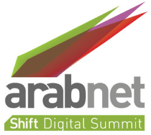

[**مؤتمر"عرب نت" يعلن أسماء المتأهلين إلى نهائيات  مسابقتي "ماراثون الأفكار" و"العرض التوضيحي للشركات الناشئة" **](https://www.it-scoop.com/2011/03/arabnet-2/)

أعلن منظمو مؤتمر "عرب نت"ArabNet  اليوم عن _ أسماء المتأهلين العشرة إلى المرحلة النهائية _لكل من "ماراثون الأفكار"، والعرض التوضيحي للشركات الناشئة، وهما مسابقتان مدرجتان ضمن المؤتمر الذي يقام بين 22 آذار (مارس) الجاري و25 منه في بيروت.

ويعتبر "عرب نت" أكبر مؤتمر لقطاع الإنترنت والهواتف الجوالة في المنطقة العربية، ويجمع على مدى أيامه الأربعة نخبة من أبرز رجال الأعمال العرب والمستثمرين والمستشارين والراغبين في تأسيس أعمال جديدة وممثلي المنظمات غير الحكومية والإعلاميين، لمناقشة أحدث الاتجاهات والتقنيات في القطاع.

وأوضح بيان لـ"عرب نت" أن مسابقة "ماراثون الأفكار" تهدف "إلى تحويل الأفكار الذكية إلى منتجات عملية، مشيراً إلى أن المتأهلين إلى المرحلة النهائية، والذين تم اختيارهم من بين مئات المتقدمين إلى المسابقة من مختلف دول المنطقة، سيحظون بفرصة لتقديم أفكارهم في دقيقتين أمام المستثمرين ورعاة الأعمال والمطورين. وتفوز الأفكار الثلاثة الأولى بجوائز نقدية كبيرة وبدعم في بناء نماذج أولية لأفكارهم.

**_وفي ما يلي أسماء المتأهلين إلى المرحلة النهائية لـ"ماراثون الأفكار"_****:**

**<!-- more -->
**

ابراهام كاماراك (قطر)

الكسندرا طعمة (الامارات العربية المتحدة)

عطية المطرفي (المملكة العربية السعودية)

الياس دباس (الامارات العربية المتحدة)

افلين الزعبي (الأردن)

محمد سماح الشيخ (الامارات العربية المتحدة)

شادي سلامة (المملكة العربية السعودية)

شريف مكتبي (لبنان)

طارق جابر (المملكة العربية السعودية)

تي جي كوين (مصر).

**أما الوصفاء فهم: **

علاء خليفة (مصر)

ايهاب الحراكي (سوريا)

هدى الوحيدي (فلسطين)

مشهور بني عامر (الأردن)

بيار ضاهر (الامارات العربية المتحدة).

وشرح البيان أن مسابقة العرض التوضيحي للشركات الناشئة، تهدف إلى دعم الشركات الناشئة في مراحلها الأولى ومساعدتها على تنمية أعمالها، مشيراً الى أن الشركات الناشئة التي تأهلت إلى المرحلة النهائية ستحظى بخمس دقائق على المسرح لعرض منتجاتها وإقناع الجمهور والحكام بإمكاناتها التسويقية. كذلك ستوفّر لهذه الشركات مساحات للعرض خلال المؤتمر، حيث يمكنها التواصل مع المستثمرين والشركاء ووسائل الإعلام لبناء العلاقات التي تساعدها على تحقيق النمو.

**_وهنا أسماء المتأهلين الى نهائيات _****مسابقة ****العرض التوضيحي للشركات الناشئة: **** **

علاء الصلال (الأردن) عن Jamalon

أسد أكبر (الأردن) عن Edufina

داني الهبر (المملكة المتحدة) عن Nuqudy

حسن بيضون (الولايات المتحدة) عن Cashbury

كارانفير سينغ (الامارات العربية المتحدة) عن iShopaholic

كريم هلال (الامارات العربية المتحدة) عن Monaqasat

محمود أبو وردة (الامارات العربية المتحدة) عن Zeedna

رفح الخطيب (المملكة العربية السعودية) عن 3eesho

رامي فرح (سوريا) عن Toosal

سامر عابدين (الامارات العربية المتحدة) عن Istikana.

**أما الوصفاء فهم:**** **

أحمد المسعودي (الولايات المتحدة) عن Aqar Map،

أمجد شحرور (الأردن) عن eSimsar

دانيال نويرث (لبنان) عن Shahiya

ايلي غريغوار خوري (لبنان) عن Dermandar

صالح الزيد (المملكة العربية السعودية) عن Tiwtemail

شريف أباظة (الامارات العربية المتحدة) عن me360.

وشدد مؤسس "عرب نت" عمر كريستيديس على أن المؤتمر "يجمع رواد الأعمال الشباب وقادة من العاملين في مجال شبكة الإنترنت العربية و صناعة الهواتف الجوالة، ويمنحهم فرصة لتقديم أفكارهم أمام لجنة من الحكام البارزين وأيضا فرصة للتواصل مع بعض أبرز رجال الأعمال وأكثرهم تأثيرا في المنطقة".

وأفاد المنظمون بأن التسجيل لحضور المنتدى لا يزال ممكناً، لكنهم لفتوا الى أن المقاعد محدودة، داعين الراغبين في التسجيل أو في الحصول على مزيد من المعلومات عن المؤتمر الى زيارة موقعه على الرابط الآتي:   [http://arabnet.me/](http://arabnet.me/)

**
**

** **

