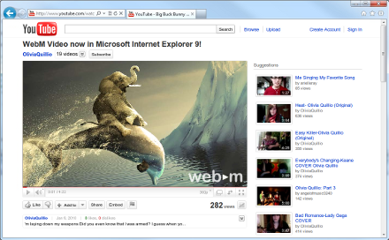

[**Google تطلق إضافة لفيديوهات WebM على متصفح Internet Explorer 9**](https://www.it-scoop.com/2011/03/google-webm-internet-explorer-9/)

بمجرد أن أطلقت Microsoft الإصدار النهائي لـ Internet Explorer 9 حتى كشفت Google عن إضافة خاصة بهذا المتصفح لدعم فيديوهات WebM.

هي حرب (أو أقرب ما تكون إلى ذلك) قائمة ما بين Microsoft و Apple الداعمتان لمعيار ملفات الفيديو H.264 من جهة، و Google ، Mozilla و Opera من جهة أخرى  و اللواتي يدعمن المعيار المفتوح WebM الذي تطوره Google، حيث أنه و بعد أن أعلنت Google عن توقف دعم متصفحها لـ H.264 سارعت Microsoft لتوفير إضافة تدعمه على الـ Chrome، و ما توفير Google لإضافة لـ WebM على IE9 إلا رد على ذلك.

و بالرغم من أن الكفة راجحة بشكل أكبر حاليا لصالح Google بسبب امتلاكها لـ Youtube أكبر "منجم" فيديوهات على الإنترنت، إلا أن "الحرب" لم تحسم بعد في ظل الجهود التي تبذلها مؤسسة Mpeg-LA للحصول على حصة أكبر من سوق الفيديوهات على الإنترنت.

إضافة WebM لـ Internet Explorer 9 متوفرة للتحميل من [هنا](http://tools.google.com/dlpage/webmmf) (إصدار أولي فقط).

شكر خاص [لمحمد البردعي ](http://arabicfoss.blogspot.com/)لإشارته للخبر.

في رأيك ؟ لمن ستكون الغلبة ؟

