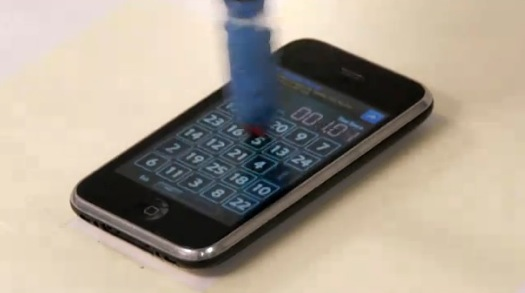

**[الرقم القياسي لسرعة الكتابة على الـ iPhone من نصيب ... آلة](https://www.it-scoop.com/2011/03/iphone-adept-quattro-robot-1-to-50)**

هي ليست كتابة  بمعناها المتعارف عليه و إنما هي أقرب ما تكون إلى ذلك، لكن ما يهمنا هنا هي سرعة القيام بذلك (سواء اعتبرناها كتابة أو لا) حيث استطاع الروبوت Adept Quattro أن ينهي لعبة   a [1 to 50](http://itunes.apple.com/app/1to50/id390866379?mt=8) على الـ iPhone   خلال أقل من 7 ثوان.

و يقوم مبدأ هذه اللعبة على النقر على الأرقام من 1 إلى 50 (أليس ذلك ما يعنيه اسمها :p ) في أقل وقت ممكن. و توضح الفيديوهات التالية كيف يقوم بذلك:

<object width="560" height="349"><embed src="http://www.youtube.com/v/kGSLwy9ptgk?fs=1&hl=fr_FR&rel=0" allowscriptaccess="always" height="349" width="560" allowfullscreen="true" type="application/x-shockwave-flash"></embed></object>

<!-- more -->

<object width="640" height="510"><embed src="http://www.youtube.com/v/SmqDHPhaO2s?fs=1&hl=fr_FR&rel=0" allowscriptaccess="always" height="510" width="640" allowfullscreen="true" type="application/x-shockwave-flash"></embed></object>

تود أن تسألني عن فائدة ذلك ؟ صراحة لا أدري لكن قد تكون له تطبيقات أخرى خارج الـ iPhone (سرعة التعرف على الصور و تنفيذ أوامر اعتمادا عليها) .

