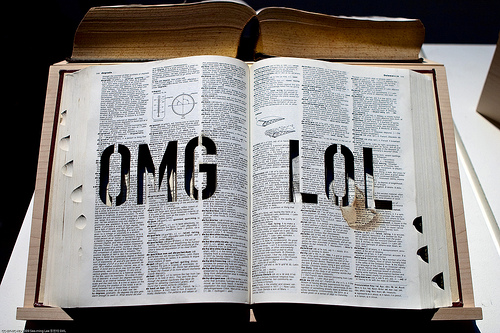

[**LOL و OMG يدخلان قاموس اللغة الانجليزية :p**](https://www.it-scoop.com/2011/03/oxford-english-dictionary-omg-lol/)

صدق أو لا تصدق، فإن بحثت في قاموس Oxford English Dictionary للغة الانجليزية عن بعض المصطلحات و الاختصارات "الغريبة" كـ OMG و LOL فسيعطيك القاموس شرحا لهما، حيث تمت إضافة العديد من هذه الاختصارات إلى القاموس في تحديث شهر مارس الجاري.

هذا ما [أعلن عنه](http://www.oed.com/public/latest/latest-update/#new) موقع القاموس، و تشمل القائمة زيادة على OMG التي تعني Oh my God و LOL التي تعني laughing out loud، اختصارات أخرى تستعمل عادة في التخاطب الالكتروني عبر تطبيقات الدردشة أو عبر رسائل الـ SMS كـ FYI (المقصود بها for your information) و BFF (المقصود بها best friends forever) و IMHO  (التي تعني in my humble opinion).

كما يعرف القاموس أيضا دخول "رموز" جديدة إليه على غرار ♥ و الذي اشتهرت باقترانها بعبارة I ♥ NY ذائعة الصيت.

و يشير موقع القاموس إلى أنه و بخلاف ما هو شائع فإن العديد من هذه الاختصارات ليست وليدة التقنية الحديثة ، و لا ترتبط بالفئة الشبابية الحالية، بل يعود استعمال بعضها لحوالي قرن من الآن، فعلى سبيل المثال تم رصد OMG في رسائل أرسلت سنة 1917، في حين تعود بدايات LOL إلى ستينيات القرن الماضي بالرغم من أنها كانت تعني حينها little old lady. أما I ♥ NYC فتم رصد أول استعمال لها سنة 1984.

هل سنسمع قريبا عن دخول :p و :) أو حتى :D إلى قاموس اللغة الانجليزية

