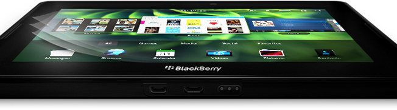

[**RIM تؤكد إمكانية تشغيل تطبيقات Android على PlayBook**](https://www.it-scoop.com/2011/03/rim-playbook-android-applications/)

بعد أن كانت الأمر مجرد [إشاعة و تخمينات](https://www.it-scoop.com/2011/01/rim-android-apps-playbook-blackberry/)، أكدت RIM -مصنعة هواتف BlackBerry- عبر [بيان صحفي](http://press.rim.com/release.jsp?id=4935) أن جهازها اللوحي القادم PlayBook سيكون قادرا على تشغيل تطبيقات Android إلى جانب تطبيقات Java.

و سيُمَكَّن PlayBook من ذلك عبر قارئ تطبيقات خاص  app players، و هو ما سيعطي دفعة قوية للجهاز اللوحي، و الذي سيستفيد علاوة على تطبيقاته الخاصة من أزيد من 200 ألف تطبيق الموجودة على الـ Android Market.

ليست هذا فحسب، فمع دعم الجهاز اللوحي لكل من Adobe AIR و تطبيقات HTML5 إلى جانب عدة التطوير الخاصة به Tablet OS Native Development Kit المعروفة اختصارا بـ NDK سيصبح PlayBook أحد الأجهزة اللوحية الأكثر "انفتاحا" مما سيوفر لها إمكانية منافسة الأجهزة اللوحية الحالية.

في رأيك هل سيستفيد PlayBook من اللعب على وتر التطبيقات ؟ أم أن مسألة السيطرة على سوق الأجهزة اللوحية باتت محسومة ؟

