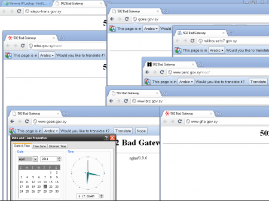
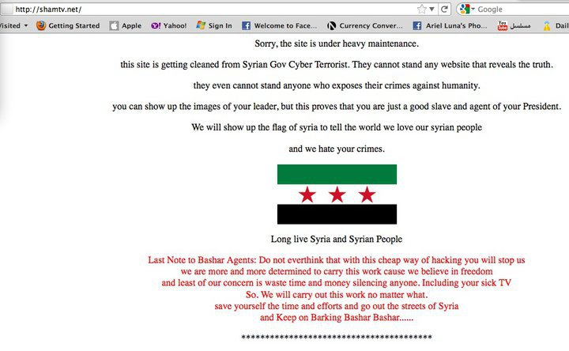

[المواقع السورية الحكومية تحت رحمة المخترقين](https://www.it-scoop.com/2011/04/syrian-government-websites-hacked/)

وصلتنا أكثر من رسالة تفيد بأن المواقع الحكومية السورية سقطت /تسقط خلال هذه الأيام الواحدة تلو الأخرى على أيدي المخترقين، و الذين تبين الرسائل المتروكة على هذه المواقع أنهم سوريون أيضا.

و تشير بعض الصور التي حصلنا عليها كيف كانت تظهر تلك المواقع لحظة اختراقها (منها من عاد إلى "الحياة الطبيعية" و منها من لا يزال معطلا).

و فيما يلي بعض الصور:

سقوط جماعي للمواقع التالية (المسكنة على نفس الخادم) :

	  * alepo-trans.gov.sy
	  * gcea.gov.sy
	  * milihouse-b7.gov.sy
	  * mhe.gov.sy
	  * perc.gov.sy
	  * btc.gov.sy
	  * gcea.gov.sy

صورة تبين سقوط موقع gfto.gov.sy

صورة تبين اختراق موقع http://shamtv.net/

