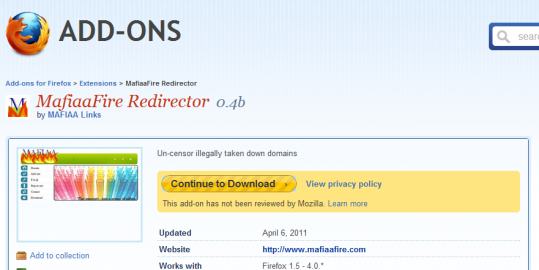

**[Mozilla ترفض طلبا للسلطات الأمريكية بحذف إضافة MafiaaFire الخاصة بـ Firefox](https://www.it-scoop.com/2011/05/mozilla-mafiaafire-mozilla-addon-dhs)**

تلقت Mozilla من سلطات الأمن الداخلي الأمريكية  the US Department of Homeland Security) [DHS](http://en.wikipedia.org/wiki/United_States_Department_of_Homeland_Security)) طلبا بحذف للإضافة الخاصة بالمتصفح Firefox المسماة [MafiaaFire](https://addons.mozilla.org/en-US/firefox/addon/mafiaafire-redirector/)، و هو الطلب الذي رفضت Mozilla تنفيذه، مثلما أشار إليهHarvey Anderson نائب رئيس Mozilla على [مدونته](https://lockshot.wordpress.com/2011/05/05/homeland-security-request-to-take-down-mafiaafire-add-on/).

و تمكن إضافة MafiaaFire من الوصول إلى نسخ [Mirror](http://en.wikipedia.org/wiki/Mirror_(computing)) من المواقع التي تقوم الـ DHS بإيقافها بسبب محتوياتها الممنوعة قانونا (من مواد ذات طابع جنسي، أو مواقع تحميل المحتويات المقرصنة) أو التي تهدد الأمن القومي كما سبق و أن فعلته مع موقع wikileaks . و يقوم مبدأ عمل الإضافة على الاتصال بموقع الخدمة و التحقق من وجود نسخ Mirror من الموقع المتوقف و تقوم بإعادة توجيه المستخدم بشكل تلقائي لإحداها.

و تعلل Mozilla قرارها هذا بكون الطلب لا يحتوي أي أمر من المحكمة. و يشير Anderson إلى أن مؤسسته تحترم جميع قرارات القضاء، و تنفذ طلباته، إلا أن الأمر هذه المرة لا يحتوي أي قرار صادر عن محكمة.

تجدر الإشارة إلى أن الـ DHS قد أوقفت ما لا يقل عن 90 موقعا دون أن يتمكن أصحابها من الدفاع عن أنفسهم، لكن في المقابل يستعمل حاليا أزيد من 8400 شخص إضافة MafiaaFire على متصفحاتهم للوصول إلى المواقع التي تتعرض لها الـ DHS، و هو الرقم المرشح للزيادة بشكل كبير خاصة مع الحملة الإعلانية غير المباشرة التي حصلت عليها الإضافة بفضل هذه الحادثة.

في رأيك هل ستصل الـ DHS إلى غايتها عن طريق القضاء أو عبر طريق آخر ؟ و هل تؤيد قرار Mozilla رفضها لحدف الإضافة ؟

