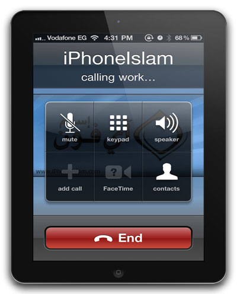

**[بعد أن كان الجميع يظنه مستحيلا، إجراء المكالمات الهاتفية بالـ iPad أصبح ممكنا و الفضل يعود لـ ... آيفون إسلام](https://www.it-scoop.com/2011/05/ipad-3g-phone-calls-iphoneislam)**

لا تدرون كم هي فرحتي كبيرة و أنا أكتب عن هذا الخبر، ليس للفائدة الكبيرة التي يقدمها هذا الحل (فلا أملك iPad ... بعد)، لكن لكونه مكتوبا بأيادي مسلمة، فبعد أن كان الجميع يظنه مستحيلا، [يعلن](http://www.iphoneislam.com/?p=11223) فريق عمل آيفون إسلام عن حل لتمكين أجهزة الـ iPad 3G من المكالمات الهاتفية.

تطبيق PhoneItiPad  لم يصدر بعد بشكل رسمي، حيث يشير الموقع أن التحقق من ثباته لا يزال جاريا، لكن الفيديو التي تعلن عن ذلك (المرفقة أدناه) لا تدع أي مجال للشك. كما أن التطبيق لا يتطلب أية إضافات خاصة للجهاز، لكن في المقابل يجب أن تكون حماية النظام مكسورة (Jailbreak).

و يمكنك أن تتحقق من الترحيب الكبير (عالميا) بهذه الحل "السحري" حيث تتحدث [الكثير من المواقع الأجنبية](http://www.google.com/search?hl=fr&biw=1280&bih=669&q=ipad+phone+call+iphoneislam&aq=f&aqi=&aql=&oq=) عن أنه التطبيق الذي "سيغير قواعد اللعبة".

إليكم الفيديو التي تبين تجربة للاتصال الهاتفي عبر الـ iPad:

<!-- more -->

<object width="560" height="349"><embed src="http://www.youtube.com/v/-36qTeAdDMI?fs=1&hl=fr_FR" allowscriptaccess="always" height="349" width="560" allowfullscreen="true" type="application/x-shockwave-flash"></embed></object>

