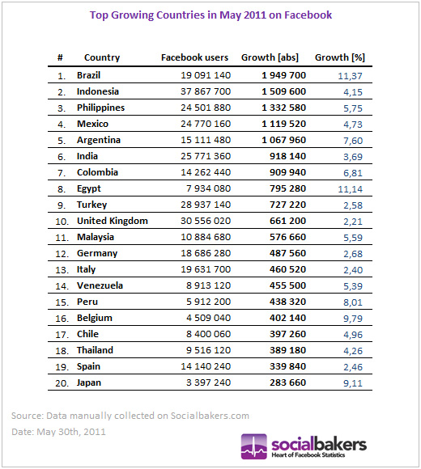

[**Facebook تقترب من حاجز الـ 700 مليون مستخدم، و البرازيل تسجل 1.9 مليون مستخدم جديد خلال شهر واحد**](https://www.it-scoop.com/2011/05/facebook-700-million-users/ )

إن صدقت [الإحصائيات](http://www.socialbakers.com/blog/171-facebook-is-globally-closing-in-to-700-million-users/) التي نشرها موقع socialbakers فإن شبكة Facebook أصبحت قاب قوسين أو أدنى من حاجز الـ 700 مليون مستخدم، و سجلت نموا كبيرا في العديد من البلدان النامية.

و تأتي البرازيل على رأس الدول الأكثر "نموا على الـ Facebook"   بتسجيلها أزيد من 1.9 مليون مستخدم جديد بنمو قدر بـ 11,37% وهو النمو الذي سيقلق من دون شك Google حيث تعتبر البرازيل البلد الأكثر استعمالا لشبكتها الاجتماعية Orkut و تحوز على [أزيد من 50% من مستخدميها](http://www.orkut.com/MembersAll). في حين حلت مصر ثامنا بنسبة نمر متقاربة (11.14%) و يقارب بذلك عدد المستخدمين المصرين لـ Facebook حاجز 8 ملايين مستخدم.

و عل صعيد الدول الأكثر استعمالا لـ Facebook تأتي إمارة موناكو على رأس الترتيب حيث بالرغم من أنها لا تملك سوى 29200 مستخدم على هذه الشبكة إلا أن ذلك [يمثل 95.47% من تعداد سكانها](http://www.socialbakers.com/blog/162-facebook-statistics-top-european-penetration/).و إن تم اعتبار Facebook كدولة فإنها ستحل ثالثا من حيث ترتيب السكان على مستوى العالم بعد كل من الصين و الهند :) .

تجدر الإشارة إلى أن Facebook لم تنشر أية إحصائيات حول عدد مستخدميها منذ حوالي سنة، و يعود آخر إعلان حول الأمر إلى شهر يوليو الماضي بمناسبة تجاوزها [حاجز 500 مليون مستخدم](../2010/07/facebook-500-million-2/).
