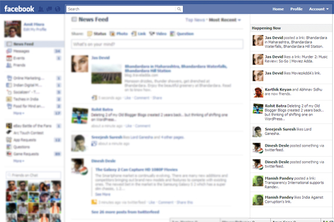

[**Facebook تجرب خاصية Happening Now الجديدة المشابهة للـ Timeline الخاصة بـ Twitter**](https://www.it-scoop.com/2011/06/facebook-happening-now/)

أشارت بعض المواقع الإخبارية التقنية مثل [mashable](http://mashable.com/2011/06/10/facebook-happening-now/) و[the next web](http://thenextweb.com/facebook/2011/06/10/facebook-begins-testing-new-real-time-happening-now-feed/) أن Facebook تجرب خدمة (Feed) جديدة تسمى Happening Now شبيهة جدا بمبدأ الـ TimeLine الخاص بـ Twitter و الذي يسمح باستعراض ما يقوم به الأصدقاء في الزمن الحقيقي.

و لقد علقت Facebook حول الخاصية الجديدة -مثلما نقرأه على موقع [the next web](http://thenextweb.com/facebook/2011/06/10/facebook-begins-testing-new-real-time-happening-now-feed/) - أنها تتم تجربتها على نسبة محدودة جدا من المستخدمين و سيتم العمل على تحسينها خلال الأسابيع القليلة القادمة بناء على نتائج هذه التجارب و من المنتظر توسيع نطاقها إلى مستخدمين آخرين لاحقا.

و كما هو ظاهر للجميع فإن فكرة الـ Happening Now شبيهة جدا بمبدأ Twitter و الـ Timeline الخاص بها، و قد تكون Facebook قد أحست بالخطر الذي يحدق بها من جهة Twitter، بالرغم من انتشارها الواسع و عدد مستخدميها الكبير و المقدر بحوالي 700 مليون، إلا أن Twitter يتفوق عليها في العديد من الجوانب و خاصة ما تعلق منها بالتحديثات في الزمن الحقيقي.

و كما هو معلوم فإن مستخدمي الإنترنت يدأبون على متابعة الأحداث (المؤتمرات على سبيل المثال) مباشرة على Twitter و ليس على Facebook، كما أن بعض التحديثات تفقد معناها مع مرور الوقت و التي تختفي على Twitter بسرعة (بسبب التغريدات الأحدث)على عكس Facebook الذي يمكن أن يعرضها لساعات طويلة.

