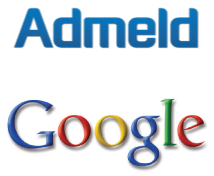

[**أنباء عن (قرب) شراء Google لـ Admeld المتخصصة في الإعلانات على الإنترنت**](https://www.it-scoop.com/2011/06/google-admeld/)

توافقت أخبار أكثر من مصدر على وجود تقارب ما بين Google و شركة [Admeld](http://www.admeld.com/) المتخصصة في الإعلانات بمختلف أنواعها على الإنترنت و تحسينها، لكنها تضاربت حول مدى تقدم المحادثات حول شراء الأولى للثانية.

في حين أكدت [TechCrunch](http://techcrunch.com/2011/06/09/google-acquires-admeld-for-400-million/?utm_source=feedburner&utm_medium=feed&utm_campaign=Feed%3A+Techcrunch+%28TechCrunch%29&utm_content=Google+Reader) خبر الشراء و أعلنت أن قيمة الصفقة تقدر بـ 400 مليون دولار، أشارت جريدة [Wall Street Journal](http://online.wsj.com/article/SB10001424052702304392704576376221042400728.html?mod=rss_Technology) أن المحادثات لا تزال جارية مع تأكيدها السعر الذي أعلنته TechCrunch، فيما اتخذت [New York Times](http://bits.blogs.nytimes.com/2011/06/09/google-in-talks-to-buy-admeld-for-400-million/?partner=rss&emc=rss) موقفا ثالثا، حيث أكدت أن المفاوضات لا تزال جارية، و أن كل الاحتمالات لا تزال ممكنة بما في ذلك فشل المفاوضات، و تشير إلى أن مثل هذه الصفقات ستثير من دون شك اهتمام سلطات الضبط (الأوروبية و الأمريكية على حد سواء) و التي ستسمع كلمتها قبل أن تتم مثل هذه الصفقات.

بالرغم من قوة Google في مجال الإعلانات على الإنترنت، إلا أنها لا تضيع أي فرص لاقتناص شركات تساعدها على تحسين أدائها، فعلى سبيل المثال، سبق لها و أن اشترت DoubleClick سنة 2008 مقابل 2.2 مليار دولار.

و إن تمت هذه الصفقة كما هو مخطط لها فستصبح Admeld الشركة [الـ 12](http://adage.com/article/digital/google-acquires-ad-optimization-firm-admeld-400-million/228108/) التي تشتريها Google منذ بداية العام الجاري، و هي الصفقة التي ستعيد الاعتبار لـ  Michael Barrett المؤسس و المدير التنفيذي لـ Admeld الذي طردته News Corp لفشله في تحقيق الأهداف الموكلة إليه، قبل أن يقرر تأسيس شركته الخاصة سنة 2007.
