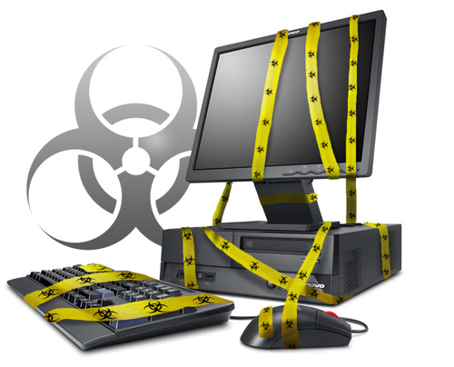

[**Kaspersky تحذر من TDL-4 ) TDSS) أكثر البرمجيات الخبيثة تطورا على مر التاريخ**](https://www.it-scoop.com/2011/07/kaspersky-tdss-tdl-4-malware/)

TDSS هو اسم البرمجية الخبيثة الجديدة التي [أعلنت ](http://www.securelist.com/en/analysis/204792180/TDL4_Top_Bot)شركة Kaspersky عن اكتشافها و تحليلها، ووصفتها بأنها أكثر البرمجيات الخبيثة تطوّراً إلى يومنا هذا. تستخدم TDSS مجموعة من الطرق لتفادي الاكتشاف عبر (signature based scan، heuristic scan، proactive scan)، وتقوم بتشفير الاتصالات بين عملائها (bots) ومركز الإدارة والتحكم الخاصة بالـ botnet.

تملك TDSS أيضاً عنصر rootkit يمكّنها من إخفاء وجود أي إصابة ببرمجيات خبيثة أخرى في النظام، الأمر الذي سنفسره لاحقاً في المقال.

هذا ليس الإصدار الأول من هذه البرمجية الخبيثة، بل الرابع (TDL-4)، حيث أن أول إصدار ظهر على العلن في عام 2008 وأطلق عليه اسم TDL، بينما ظهر الإصدار الثالث في 2010 وأطلق عليه اسم TDL-3 وتم شرحه بالتفصيل في [مقالة نشرت في شهر أغسطس 2010](http://www.securelist.com/en/analysis/204792131/TDSS).

يذكر التقرير أيضاً بأن مبرمجي TDSS لم يقوموا ببيع الشفرة المصدرية لبرنامجهم حتى نهاية عام 2010. ففي شهر ديسمبر، بينما كان خبراء Kaspersky يقومون بتحليل عينة من TDSS، اكتشفوا جزء مشفراً من القرص الصلب خاص بـ TDL-3 يحتوي على ملفات تعود إلى برمجية خبيثة أخرى هي SHIZ.

التعديلات التي تمت على إعدادات TDL-3 وإضافة برمجية تسويق أخرى تشير إلى أن الشفرة المصدرية لـ TDL-3 تم بيعها لمجرمي الإنترنت الذين لديهم صلة ببرمجية SHIZ الخبيثة.

من التعديلات والإضافات الجديرة بالذكر بخصوص TDSS:

	  * برنامج Affiliate program  لمكافئة من يساهم في      نشر البرمجية الخبيثة حيث يتم منح ما بين 20 إلى 200 دولار مقابل كل 1000      جهاز مصاب.
	  * شبكة اتصالات      مشّفرة.
	  * مضاد فيروسات      (تقوم البرمجية بإزالة بعض البرمجيات الخبيثة الأخرى من الجهاز المصاب      للتخفيف من أعراض إصابته بأي نوع من الفيروسات حتى تضمن ألا يتم فحصه بشكل      مكثّف لأطول فترة ممكنة مما يعني أنها ستستمر بالعمل فترة أطول)
	  * تتصف بأنها bootkit أي أنها تصيب الـ      MBR وتزرع نفسها فيه لتعمل قبل أن يعمل نظام      التشغيل وبالتالي تتمكن من إفشال عمل العديد من البرمجيات الموجودة في النظام.
	  * إمكانية الاتصال      مع شبكة الند للند Kad الخاصة بتبادل الملفات      P2P.
	  * تضيف proxy server إلى خدمة svchost.exe مما يمكّن      المتحكمين بالأجهزة المصابة من تصفّح مواقع معينة عبر الانترنت من خلال      الأجهزة المصابة بصورة anonymous.
	  * دعم أنظمة 64bit  في  user-mode.
	  * التعامل مع      نتائج البحث الخاصة بمحركات بحث عديدة، واستبدالها بنتائج بحث مخصصة.
	  * العديد من مراكز      الإدارة والتحكم غير المركزية (decentralized,      server-less).

و تشير Kaspersky  أن برمجية TDSS أصابت لحد الساعة ما لا يقل عن 4.5 مليون جهاز عبر مختلف بلدان العالم (28% منها في الولايات المتحدة).

أنصح بقراءة المقال الكامل من خلال [زيارة الرابط](http://www.securelist.com/en/analysis/204792180/TDL4_Top_Bot).
