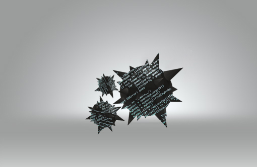

[**الشفرة المصدرية لدودة Stuxnet أصبحت متاحة للجميع، سارع و حمل نسختك :)**](https://www.it-scoop.com/2011/07/stuxnet-source-code-released-online)

[ذكر](http://www.thehackernews.com/2011/07/stuxnet-source-code-released-online.html) موقع the hacker news أن الشفرة المصدرية لدودة Stuxnet   أصبحت متوفرة للتحميل و لقد وفر الموقع رابطا لتحميله.

لا ندري إن كانت الشفرة المصدرية المزعومة هي فعلا لـ Stuxnet، لكن يشير تعليقان على الموقع آنف الذكر أن الأمر يتعلق بالشفرة المتحصل عليها نتيجة قراءة الدودة من خلال برنامج التنقيح و الهندسة العكسية IDA disassembler، و ليست الشفرة الأصلية للدودة.

Stuxnet  هي دودة برمجية تصيب الحواسيب التي تشتغل على أنظمة Microsoft و التي صممت خصيصا لإلحاق الضرر بالمنشآت النووية الإيرانية التي تعرضت لمتاعب تقنية لم يعرف لها سبب لحين اكتشاف إصابتها بهذه الدودة الخطيرة في يوليو 2010، و تقوم هذه الدودة على استهداف البرامج والمعدات الصناعية فقط.

في حين أنها ليست المرة الأولى التي استهدفت الفيروسات و البرامج الخبيثة النظم الصناعية ، لكن Stuxnet تعتبر من أذكاها  نظرا لشدة تعقيد برمجتها و أدائها شبه الخفي حيث تتلاعب الأنظمة مما يسمح لها بتسبيب أعطاب من دون أن يتم اكتشافها، حيث أنها  تعيد برمجة [أجهزة التحكم المنطقية القابلة للبرمجة](http://ar.wikipedia.org/wiki/%D8%AC%D9%87%D8%A7%D8%B2_%D8%AA%D8%AD%D9%83%D9%85_%D9%85%D9%86%D8%B7%D9%82%D9%8A_%D9%82%D8%A7%D8%A8%D9%84_%D9%84%D9%84%D8%A8%D8%B1%D9%85%D8%AC%D8%A9) (: (Programmable Logic Controllerالمستخدمة في المرافق الصناعية. في بيئة ICS ، و التي تقوم تنظيم معدل التدفق للحفاظ على الضغط والتحكم في درجات الحرارة

هل تظن أن نشر الشفرة المصدرية سيكون له أثر سلبي أو إيجابي خاصة على أمن المنشئات االصناعية ؟

للمزيد حول دودة Stuxnet:

[stuxnet  في مؤتمر  ted](http://blog.ted.com/2011/03/29/cracking-stuxnet-a-21st-century-cyber-weapon-ralph-langner-on-ted-com/)
[فيديو توضيحي لبنية  stuxnet](http://vimeo.com/groups/Visualization/videos/25118844)
