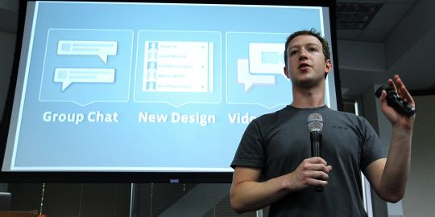

[**مثلما كان منتظرا، Facebook توفر خاصية الدردشة المرئية بالتعاون مع Skype**](https://www.it-scoop.com/2011/07/facebook-videocalling-skype/)

أعلن Mark Zuckerberg هذا المساء [تضمين](https://www.facebook.com/videocalling) شبكته الاجتماعية Facebook للدردشة المرئية و ذلك بالتعاون مع Skype، إضافة إلى خواص إضافية تخص الدردشة الكتابية بشكل عام.

فيما يخص الدردشة المرئية فإنها لا تتطلب تنصيب Skype كاملا على كل جهاز، و إنما توفر الشبكة إضافة خاصة لتوفير هذه الخاصية، حيث يصبح بإمكان محادثة الأصدقاء الذين يظهرون في قائمة الدردشة مباشرة بالنقر على زر الفيديو و الذي يظهر في نافذة الدردشة الكلاسيكية مثلما هو ظاهر في الصورة التالية:

كما تم تحسين الدردشة الكتابية بتمكينها من الدردشة الجماعية و تحسين واجهتها الرسومية بشكل عام.

و نقرأ على [جريدة Le Monde الفرنسية](http://www.lemonde.fr/technologies/article/2011/07/06/facebook-integre-les-fonctionnalites-de-skype_1545707_651865.html?utm_source=twitterfeed&utm_medium=twitter) –و التي استندت إلى مصادر من الصحافة الأمريكية- أن Facebook لم تكن  تنوي الإعلان عن هذه الخواص خلال هذا الأسبوع  حيث كان الأمر مبرمجا بعد أشهر من الآن، إلا أن إطلاق Google لطبقتها الاجتماعية Google+ هو ما دفعها إلى ذلك، حيث أن هذه الأخيرة توفر ميزة الدردشة المرئية (مثلما هو الحال الآن مع Facebook) الجماعية و التي يمكن أن تجمع 10 أشخاص في آن واحد.

و تستدل الجريدة في حديثها عن قلق Facebook إزاء Google+ بقيام الأولى بمنع إضافة وفرها أحد المطورين المستقلين و التي تمكن من نقل بيانات المستخدمين إلى Google+، و هي الخطوة التي تبدو منطقية خاصة و أن Google قد سبق لها و أن منعت Facebook من الوصول إلى بيانات مستخدميها على Gmail.

