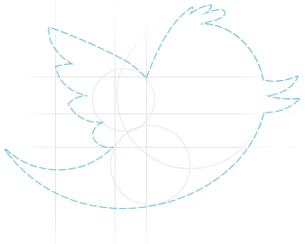

[**تجاوز تطبيقات Twitter حاجز مليون تطبيق، و تسجيل ميلاد تطبيق جديد كل 1.5 ثانية**](https://www.it-scoop.com/2011/07/twitter-ecosystem-1-million-applications/)

في خطوة من شأنها أن تعيد بعض الأمل للمطورين المهتمين بمنصتها، [أعلنت](http://blog.twitter.com/2011/07/one-million-registered-twitter-apps.html) Twitter هذا المساء عن تجاوز عدد التطبيقات التي بنيت اعتمادا على شبكتها الاجتماعية حاجز المليون تطبيق.

و لقد ساهم نحو 750 ألف مطور في كتابة هذه التطبيقات، و التي سجلت ارتفاعا كبيرا جدا خلال الأشهر الاثني عشر الماضية، حيث لم يكن عدد تطبيقات Twitter يتجاوز 150 ألفا منذ سنة مضت.

لكن في المقابل قد لا تكون هذه الأرقام بذلك الرونق الذي تود Twitter أن تظهرها به، حيث يتم تسجيل ميلاد تطبيق جديد كل 1.5 ثانية، مما يدفع إلى التساؤل إن كانت تجارب الهواة من المبرمجين و التطبيقات التي ولدت ميتة إضافة إلى تلك أجهضت قبل ميلادها محسوبة ضمن هذا المليون.

و في ردها عن تشكيك الكثيرين في جدوى إنشاء شركات ناشئة تختص في خدماتها، أشارت Twitter أنه تم استثمار ما لا يقل عن 500 مليون دولار في  هذه التطبيقات منذ ديسمبر 2010، إضافة إلى صرف أزيد من مليار دولار في شراء شركات ناشئة تختص في تطويرها.

و لتغازل المطورين أكثر أطلقت Twitter [موقعا جديدا](https://dev.twitter.com/) خاصا بهم -يسُرُّ الزائرينَ-  مبنيا [باستخدام Drupal](https://dev.twitter.com/blog/new-twitter-developer-site)، حيث تمت تحسين خواص في الموقع القديم و توفير أخرى لم تكن موجودة من قبل.

الأسئلة التي تطرح نفسها هي: كم هي نسبة التطبيقات التي تستخدم فعليا و بشكل دوري؟ و هل يتناقض تشجيع Twitter لمطوري تطبيقاتها و حثهم على كتابة تطبيقات جديدة مع محاولاتها المتكررة لاستنساخ التجارب الناجحة بدل شرائها ؟
