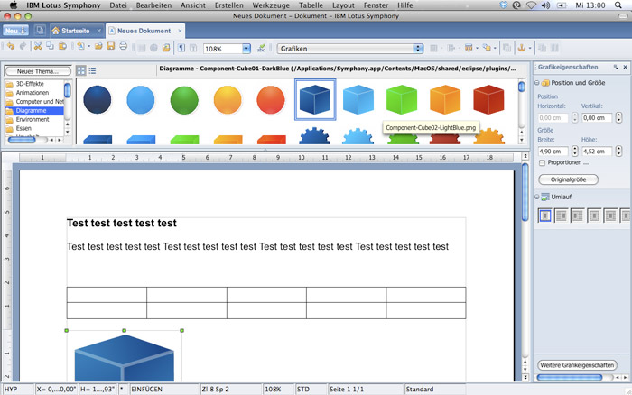

[**IBM ستتبرع بمصدر حزمتها المكتبية Lotus Symphony لمنظمة Apache لدعم تطوير OpenOffice.org**](https://www.it-scoop.com/2011/07/ibm-donate-lotus-symphony-source-code-apache)

لم تمض سوى أسابيع قليلة عن [تخلي Oracle عن حزمتها المكتبية OpenOffice.org](../2011/04/oracle-announces-its-intention-to-move-openoffice-org-to-a-community-based-project/) لصالح منظمة Apache، حتى قررت IBM السير على خطاها، حيث [أعلنت](http://www-03.ibm.com/software/lotus/symphony/buzz.nsf/web_DisPlayPlugin?open&unid=955E9C0EC712EC47852578CD0063A209&category=announcements) عن نيتها التبرع بالشفرة المصدرية لحزمتها المصدرية Lotus Symphony لدعم تطوير حزمة OpenOffice.org.

ما الذي ستستفيد منه حزمة OpenOffice ؟ تحسينات كثيرة، أهمها تحسين قابلية استخدام الحزمة، تعزيز أدائها، إلى جانب دعم VBA. كما لا يستبعد أن تستفيد حزمة OpenOffice.org من تحسينات تخص الواجهة الرسومية، حيث تعتبر واجهة Lotus Symphony أكثر جمالا.

وتسعى IBM من خلال هذه الخطوة إلى تلميع صورتها في عالم المصادر المفتوحة، حيث تشير إلى أنها لم تكن في السابق عضوا مثاليا في مجتمع OpenOffice.org.

تجدر الإشارة إلى أن حزمة Lotus Symphony توزع مجانا من دون أن تكون مفتوحة المصدر، رغم كونها أحد فروع (Fork) حزمة OpenOffice.org.
