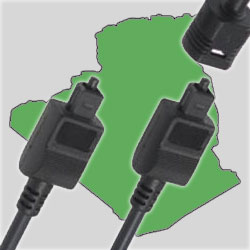

[**اتصالات الجزائر تعلن عن تذبذبات وانقطاعات في شبكة الإنترنت في الجزائر خلال هذا الأسبوع**](https://www.it-scoop.com/2011/07/algeria-5-days-internet-outage/)

أعلنت اتصالات الجزائر أن شبكة الإنترنت في الجزائر ستشهد اضطرابات وانقطاعات ابتداءً من يوم غد الأحد وسيمتد الأمر إلى غاية يوم الخميس القادم وذلك لإجراء تصليحات خارجة عن نطاقها.

وتشير بعض المواقع التي تناقلت الخبر كـ [DNA Algérie](http://www.dna-algerie.com/medias/algerie-internet-perturbe-pendant-5-jours-independamment-de-la-volonte-d-algerie-telecom-2) (استنادا إلى بيان صحفي لم يتسن لنا الحصول على نسخة منه)، أن الأمر يتعلق بتصليحات في الكابل البحري SMW4 في شقه الذي يربط مرسيليا بالإسكندرية والذي يربط جنوب شرق آسيا بأوروبا الغربية، وستعمد اتصالات الجزائر إلى استعمال نظام ALPAL2 (كابل بحري آخر) للحد من التذبذبات و الانقطاعات. و تشير بعض المواقع أن هذا الانقطاع يعتبر الأهم خلال السنوات الخمس الماضية.

و بناء على هذا، نعلم زوار المجلة الأعزاء أن تغطية الأخبار التقنية على المجلة قد يتذبذب بدورها أو تنقطع خلال نفس الفترة.
