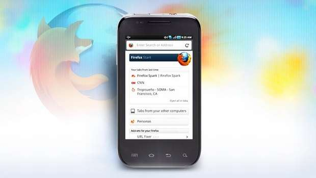

[**Mozilla تبدأ العمل على Boot To Gecko: مشروع لنظام تشغيل سحابي... خاص بالهواتف المحمولة**](https://www.it-scoop.com/2011/07/mozilla-boot-to-gecko/)

ربّما تعرفون Chrome OS نظام التّشغيل السّحابيّ من Google، النّظام الّذي يعتمد بشكل كامل على تطبيقات الويب لمساعدة المستخدم في إنجاز مهامّه، فعند الدّخول إلى النّظام ستجد أمامك متصفّح الويب، فقط لا غير، فمثلاً، بدلاً من استخدام Microsoft Office أو OpenOffice أو غيرهما من أطقم المكتب "التقليديّة" ستعتمد على Google Docs أو غيرها، هذه الخدمات السّحابيّة تعمل ضمن المتصفّح وتستغلّ الكثير من القدرات الحديثة للمتصفّحات لتنجز مهامّك بشكل كامل بالاعتماد على الويب دون الحاجة لتثبيت أيّة برامج.

 

الخبر المثير لدينا هو أنّ Mozilla -المؤسّسة المطوّرة للمتصفّح الشّهير Firefox- [قرّرت](https://wiki.mozilla.org/B2G) القفز إلى مرحلة أبعد، وتحمل طموحًا أكبر، وهذه الفكرة تتلخّص** بإنشاء نظام تشغيل سحابيّ للهواتف المحمولة**! الفكرة نفسها بالنّسبة للحواسب كانت فيما مضى ضربًا من الخيال... فما بالك عندما نتحدّث عن تطبيق نفس الفكرة على الهواتف المحمولة؟

Mozilla تعمل الآن على تطوير هذه الفكرة وتحويلها إلى واقع، وقد أطلقت على المشروع اسم Boot to Gecko أو اختصارًا B2G، وبحسب الدّكتور Andreas Gal، وهو باحث لدى المؤسّسة، فإنّ الهدف هو "جعل تقنيّات الويب المفتوحة قاعدة أفضل لتطبيقات الهواتف المحمولة والحواسب على حدّ سواء".

لم يكتفِ Gal بطرح الفكرة، بل إنّه قسّم العمليّة إلى مراحل عدّة:

	  1. **واجهات برمجيّة جديدة للويب:** خلق واجهات برمجيّة APIs لخدمات الهواتف المحمولة الأساسيّة (الرّسائل القصيرة والمكالمات والتّصوير NFC، وBluetooth وUSB).
	  2. **نظام الامتيازات:** إتاحة طريقة آمنة لتطبيقات الويب على الهواتف المحمولة للوصول إلى هذه الخدمات بحسب الحاجة.
	  3. **الإقلاع**: صنع نموذج لجهاز متوافق مع Android الّذي سيستفيد النّظام الجديد من بعض أجزائه كالنّواة وبرامج التّشغيل drivers.
	  4. **التّطبيقات:** نقل تطبيقات موجودة وبناء تطبيقات جديدة لعرض قدرات النّظام الجديد.

بهذا نحصل على تطبيقات موحّدة تعمل على جميع الأجهزة القادرة على تصفّح الويب بقدراته الحديثة، على العكس من التّطبيقات الحاليّة والمحدودة بأجهزة أو أنظمة تشغيل معيّنة. وتقول Mozilla أنّ البرمجة والتّطوير سيكونان على العلن وسيتمّ إصدار الشّيفرة البرمجيّة في الوقت الفعليّ دون تأخير... وتقول أيضًا أنّها لا تريد لهذه التّطبيقات أن تعمل على Firefox بل على أيّ متصفّح ويب!

وهل تعتقد -عزيزي القارئ- أنّ الفكرة ستنجح؟
