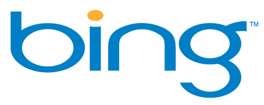

[**هل ستضطر Microsoft لبيع محرك البحث Bing ؟**](https://www.it-scoop.com/2011/07/should-microsoft-sell-bing/)

"Bing يشتت انتباه Microsoft" ، هكذا عنونت جريدة the new york times [مقالها التحليلي](http://www.nytimes.com/2011/07/25/business/bing-becomes-a-costly-distraction-for-microsoft-breakingviews.html) الذي يتحدث عن مستقبل Bing و احتمال تخلص Microsoft  منه عبر بيعه، و يشير المقال إلى شاريين محتملين: Facebook و Apple.

وتشير الجريدة إلى أن هذه الخطوة –لو تمت- ستكون في صالح المستثمرين الذين لم يعد يفضل بعضهم الاستثمار في محرك بحث لا يستطيع أن يحل إلا ثانيا، رغم كل الأموال التي بذلت فيه ورغم الشراكات التي تعقدها Microsoft وخاصة شراكتها مع Yahoo التي تمتد لعشر سنوات، والتي حتى و إن آتت ثمارها فإن محصول عامين منها لم يشفع لمحرك البحث ليتبوأ المقعد الذي كان يصبو إليه، حيث أنه لا تتجاوز حصته 25% من سوق البحث في أمريكا الشمالية.

ولقد سجل القسم المسؤول عن Bing لوحده خسائر قدرت بـ 2.6 مليار دولار خلال السنة الماضية، أي ما يعادل عشر الفوائد التي حققتها Microsoft عبر باقي منتجاتها، إلا أنه في المقابل سجلت مداخيل الإعلانات على محرك البحث ارتفاعا قدر بـ 15%.

لكن كم سيقدر ثمن Bing لو عرض للبيع؟ يقدر المحللان Robert Cyran  و  Martin Hutchinson ثمن محرك البحث بحوالي 11 مليار دولار، وهو السعر الذي قد يثير اهتمام Facebook التي قد تقرر دخول معترك البحث على الإنترنت ردا على Google التي تحاول منافستها في مجال تخصصها.

السؤال الذي يطرح نفسه هو: هل سيلعب شراء Facebook لمحرك البحث Bing دورا في تقدمها خطوة إلى الأمام، أم في تراجعها خطوتين إلى الخلف؟

