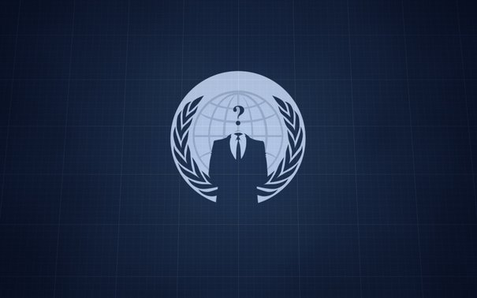

[**Anonymous يحددون الخامس من نوفمبر موعدا لـ"تدمير" Facebook**](https://www.it-scoop.com/2011/08/anonymous-facebook/)

بعد أن استهدفوا العديد من المواقع والخدمات العالمية أحدثها موقع وزارة الدفاع السورية ، يتوعد نشطاء "فيلق" القرصنة Anonymous هذه المرة شبكة Facebook بالتدمير، وحددوا الخامس من نوفمبر القادم موعدا لذلك.

ويركز [الإعلان](http://piratepad.net/YCPcpwrl09) عن هذه العلمية على عدم احترام Facebook لخصوصية مستخدميها، واحتفاظها ببياناتهم حتى بعد حذفهم لحساباتهم (ما يحدث في Facebook يبقى في Facebook مثلما تشير إليه Anonymous)، كما اتهموا الشبكة ببيعها لهذه البيانات للمنظمات الحكومية.

وتشير الحركة أنه سيأتي اليوم الذي سيعرف فيه الجميع أن ما ستقوم به Anonymous هو الصواب بعينه، مؤكدين على أنهم لا ينوون إلحاق الضرر بأحد، وإنما هَمُّهم هو حماية الجميع.

الغريب في الأمر أن الفيديو التي يعلن فيها Anonymous عن العملية رُفعت إلى Youtoube منتصف شهر يوليو المنصرم وهي الفترة التي سبقها إرسال 3 تغريدات على [حساب العملية على Twitter](https://twitter.com/#%21/OpFacebook)، ولم تُحدث أي ضجة إلى غاية يوم أمس وهذا بعد أن سلطت [الصحافة الإسبانية](http://www.20minutos.es/noticia/1129645/0/anonymous/ataque/facebook/) الضوء عليها، مثلما أشارت إليه بعض المواقع.

الفيديو التي تتوعد فيها Anonymous بتدمير Facebook:

<!-- more -->

<iframe src="http://www.youtube.com/embed/SWQTS8zqYXU" height="349" frameborder="0" width="425"></iframe>

لماذا فضلت الحركة الإعلان عن العملية قبل عدة أشهر طويلة من موعدها؟ هو الأمر مجرد تخويف؟ أم أن الحركة تنوي فعلا الإيفاء بوعدها؟
