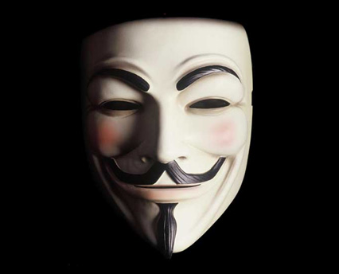

[**حركة Anonymous تنفي جزئيا صلتها بعملية تدمير Facebook**](https://www.it-scoop.com/2011/08/anonymous-facebook-2/)

بعد أن تناقلت وسائل الإعلام [خبرا](../2011/08/anonymous-facebook/) مفاده أن نشطاء حركة Anonymous يحددون الخامس من شهر نوفمبر كموعد لتدمير Facebook، فنًّد نشطاء الحركة الخبرَ عبر [تغريدة على Twitter](https://twitter.com/#%21/anonops/status/101152229087657984) مبيِّنين أنهم لا يقومون بمثل هذه العمليات.

ثم ما لبثت أن تلت هذه التغريدةَ [تغريدةٌ أخرى](https://twitter.com/#%21/anonops/status/101194056008351744) على نفس الحساب تبين أن العملية يقف وراءها بعض نشطاء الحركة (أو Anons كما يسمون أنفسهم) لكن ذلك لا يعني أن الحركة كلها تتبنى العملية. وهو ما يعتبر "تناقضا" إلى حد ما نظرا لحدة الخطاب المنتهج في التغريدة الأولى والتي تطلب من وسائل الإعلام "التوقف عن الكذب"، مما يدعو إلى التساؤل عن مدى هشاشة/تنظيم الحركة وعن قدرتها في فرض نظام موحد على كامل أعضائها الذين تبقى هوياتهم مجهولة.

ولمن تساءل عن سر اختيار هذا التاريخ بالضبط، فالأمر له دلالة تاريخية، ويتعلق الأمر بذكرى حادثة [Gunpowder Plot](http://en.wikipedia.org/wiki/Gunpowder_Plot) التي تم فيها استهداف جاك الأول ملك بريطانيا والبرلمان البريطاني سنة 1605 والتي كان وراءها [Guy Fawkes](http://en.wikipedia.org/wiki/Guy_Fawkes)، الشخصية التي استوحي منها قناع فيلم [V for Vendetta](http://en.wikipedia.org/wiki/V_for_Vendetta) الذي يستعمله نشطاء حركة Anonymous كرمز لهم (الصورة المرفقة أعلاه).
