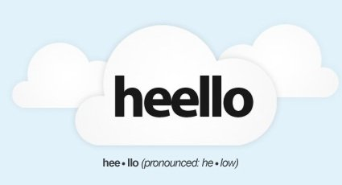

[**مؤسس TwitPic يطلق heello شبيه Twitter بُعيد تعميم Twitter لخاصية رفع الصور على موقعها**](https://www.it-scoop.com/2011/08/heello/)

مباشرة بعد أن عمَّمت Twitter [خاصية رفع الصور من خلال موقعها](http://twitter.com/#%21/twitter/status/100648586638929920) لجميع مستخدميها، أعلن  [Noah Everett](http://twitter.com/#%21/noaheverett) مؤسس TwitPic خدمة تشارك الصور على Twitter عن [إطلاقه لخدمة تدوين مصغر منافسة لـ Twitter](http://venturebeat.com/2011/08/10/heello/) أطلق عليها اسم [heello](http://www.heello.com/).

الخدمة تشابه Twitter إلى حد التطابق حيث أن الاختلاف الوحيد يكمن في المسمَّيات، حيث تحوَّلت التغريدات Tweets إلى Ping وتحوّلت المتابعة following إلى استماع listening أما عملية Retweet فسمِّيت echo.

إطلاق خدمات منافسة من عادتها إنعاش الأسواق التي تستهدفها، لكن إطلاق الخدمة بشكلها الحالي الذي لا يمثل أية إضافة بالنسبة لـ Twitter لا يسمن ولا يغني من جوع*، كما أنه من غير المتوقع أن نشهد تهافتا على الخدمة كونها متوفرة للجميع من دون أي نوع من الحصرية أو استعمال لنظام الدعوات المغلق.

ويشير Noah Everett أن إطلاق شبكته الجديدة مباشرة بعد إضافة Twitter لخاصية رفع الصور [مجرد صدفة](http://venturebeat.com/2011/08/10/heello/)،  لكنه أبدى سعادته منها، ويشير إلى أن شبكته ستعرف تحسينات عديدة مستقبلا، ويتعلق الأمر بإمكانية تشارك الفيديو، تحديد  الأماكن، دعم تطبيقات الهواتف، إلى جانب توفير خاصية القوائم الموجودة على Twitter والتي سيُطلق عليها اسم Channels.

هل سيقول المغردون Goodbye لـ Twitter بعد انتقالهم إلى Heello؟ أم أن الأمر مجرد حملة إعلانية لـ Twitpic؟

___________________

*:قبل أن تسأل، لم أكن جائعا لحظة كتابة هذه الجملة:)
