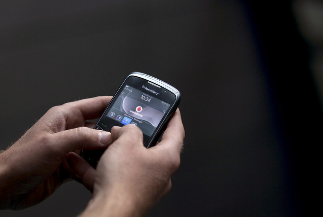

[**RIM تعتزم إطلاق هواتف BlackBerry مجهزة بنظام QNX متوافقة مع تطبيقات Android**](https://www.it-scoop.com/2011/08/rim-blackberry-qnx-android/)

[كشفت bloomberg](http://www.bloomberg.com/news/2011-08-24/blackberry-said-to-get-android-apps-as-rim-seeks-to-widen-device-s-appeal.html) التي اعتمدت على مصادر داخلية من الشركة، أن Research In Motion تعتزم إطلاق هواتف BlackBerry مجهزة بنظام QNX  وذلك لتمكينها من تشغيل تطبيقات Android.

و ستستفيد الهواتف الجديدة التي من المنتظر صدورها بداية العام القادم من أعداد التطبيقات المتزايدة التي يعرفها الـ Android Market المقدرة بـ 250 ألف تطبيق والتي تمثل 6 أضعاف عدد التطبيقات التي يحتويها متجر تطبيقات BlackBerry App World.

وتأتي هذه الخطوة بعد التراجع الذي شهدته حصة هواتف BlackBerry في ظل المنافسة التي تتعرض لها من قبل iPhone، أو الهواتف الذكية المجهزة بأنظمة Android، فبالرغم من تمكنها من بيع 12.7 مليون جهاز خلال الفصل الثاني من العام الجاري، أي ما يمثل زيادة تقدر بـ 08% مقارنة بنفس الفترة من العام الماضي، إلا أن حصتها [تقلصت إلى 03%](http://www.siliconrepublic.com/business/item/23092-global-mobile-device-sales) بعد أن كانت في حدود 3.2% من عام مضى في حين تمكن مصنع مثل ZTE الصيني من مضاعفة حصته من السوق خلال نفس الفترة ببيع 13 مليون جهاز، وهو الأمر الذي يجعله في نفس الترتيب تقريبا مع RIM.

في المقابل، تسعى RIM لزيادة حصة جهازها اللوحي PlayBook بشتى الطرق، حيث من المتوقع أن تطلق الشركة تحديثا له يمكنه من تشغيل تطبيقات Android قبل إطلاق هذه الهواتف. وبالرغم من جودة PlayBook من حيث التصنيع ومكونات الجهاز، إلا أن ذلك لم يشفع لمبيعاته، حيث أن توقعات RIM لمبيعات الجهاز خلال الفصل الأول من سنتها المالية تراجعت [إلى 900 ألف جهاز](http://brianshall.com/content/wow-900000-people-still-plan-buying-blackberry-playbook) بعد أن كانت في حدود المليونين في بداية الأمر. في حين كانت توقعات [أحد مكاتب الدراسات](http://www.bgr.com/2011/05/18/250000-blackberry-playbook-tablets-sold-to-date-rbc-says/) أكثر تشاؤما، حيث أنها لم تكن تتوقع أن تتجاوز هذه المبيعات 500 ألف جهاز.

هل تتوقع ارتفاع مبيعات BlackBerry من جديد بعد تمكينها من تطبيقات Android ؟
