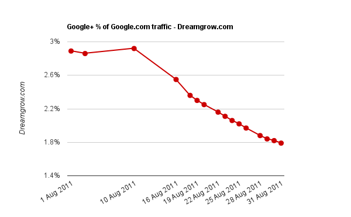
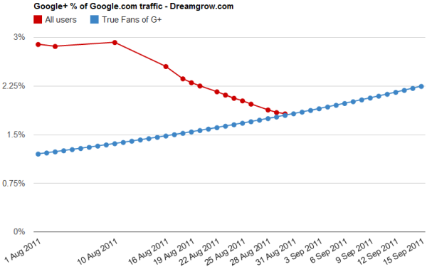

[**دراسة تعتمد على إحصائيات Alexa تشير إلى تراجع عدد زيارات Google+ خلال الشهر الماضي**](https://www.it-scoop.com/2011/08/google-plus-is-failing-data/)

تناقلت وسائل الإعلام خبرا يشير إلى تراجع عدد زيارات Google+ خلال الشهر الماضي معتمدا على [دراسة  أعدتها Dream Grow](http://www.dreamgrow.com/google-plus-is-failing-data/)، والتي تعتمد على إحصائيات Alexa.

الدراسة لا تعتمد على عدد الزيارات الفعلي للشبكة، وإنما على النسبة التي تمثلها زيارات Google+ من إجمالي زيارات موقع Google.com، حيث أن هذه الأخيرة تراجعت من 2.89% بداية شهر أغسطس إلى 1.82% في الثلاثين منه.

ولقد تعرضت الدراسة إلى سيل من الانتقادات والتي تظهر جلية في التعليقات المنشورة في [التدوينة التي تعلن عن هذه النتائج](http://www.dreamgrow.com/google-plus-is-failing-data/)، فمن جهة لا يمكن اعتبار إحصائيات Alexa دقيقة حيث أن شريط أدواتها لا نجده إلا على متصفحات الأفراد الذي رغبوا في تنصيبه، بالرغم من أن Dream Grow تتحجج بأمر آخر، وهو أن الإحصائيات تتعلق بنفس الموقع خلال فترتين مختلفتين (أي أنه تم الأخذ بالحسبان زيارات نفس الأشخاص لنفس الموقع وليس لموقعين مختلفين)، وهي الحجة التي [تعرضت بدورها للتشكيك](http://www.dreamgrow.com/google-plus-is-failing-data/comment-page-1/#comment-17747) (احتمال حذف الشريط من المتصفح). ومن جهة أخرى، لا يمكن اعتبار تراجع هذه النسبة –وإن كان حقيقيا- مؤشرا على تراجع شبكة Google+، حيث أنه من الممكن أن يكون نتيجة لزيادة نسب باقي خدمات Google.

حاولت Dream Grow تدارك الوضع، حيث نشرت [تدوينة جديدة](http://www.dreamgrow.com/google-plus-is-not-failing/) عنونتها بعكس عنوان التدوينة الأولى ([Google+ is NOT failing!](http://www.dreamgrow.com/google-plus-is-not-failing/))، حيث أشارت إلى إمكانية أن تكون الزيارات المفقودة تخص المستخدمين الذين أرادوا فقط التعرف على الشبكة ومعرفة مزاياها قبل أن ينتقلوا إلى ما سواها (moved on to next new shiny object).

هل تستخدم Google+ ؟ وهل زاد استخدامك لها مؤخرا أم قل؟
