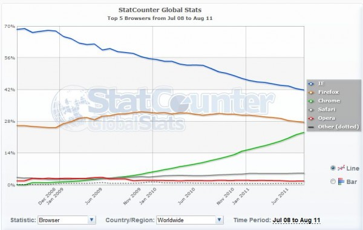

[**Internet Explorer يواصل سقوطه في ظل النمو المتزايد لعدد مستخدمي Chrome حسب أحدث إحصائيات Statcounter**](https://www.it-scoop.com/2011/09/browser-usage-stats-july-2011‎/)

إن كان  تراجع  حصة Internet Explorer من سوق المتصفحات في السابق راجعا إلى الاستخدام المتزايد لمتصفح Firefox، فإن المعطيات تغيرت في الأشهر القليلة الماضية، حيث أصبح "زحف" Chrome هو من يعمق جراح Internet Explorer بالرغم من الأشواط الكبيرة التي قطعها الإصدار 9 من متصفح Microsoft الأسطوري مثلما تشير إليه [إحصائيات StatCounter](http://gs.statcounter.com/#browser-ww-monthly-200807-201108).

ولم تعد حصة Firefox تبرح مكانها حيث أنها فضلت الطواف حول نسبة 30%، مسجلة نسبة بـ27.5% شهر يوليو الماضي (ما بين 08 يوليو و11 أغسطس على وجه التحديد) أي ما يمثل  تراجعا معتبرا مقارنة بالـ32% المسجلة في شهر أكتوبر الماضي. في حين هوت حصة Internet Explorer إلى غاية  40% بعد أن كانت مقدرة بـ50% في أكتوبر الماضي، وأصبحت بذلك نسبة 70% التي كان يعرفها المتصفح سنة 2008 ضربا من الماضي.

وقد تكون سياسة الإصدارات المتسارعة التي انتهجها متصفح Chrome قد آتت ثمارها، ففي أقل من 3 سنوات (المتصفح يكمل اليوم عامه الثالث) استطاع متصفح Google أن يحصل على نسبة 23.17% مسجلا بذلك نموا سريعا للغاية، وهو النمو الذي إن استمر على نفس الوتيرة من شأنه أن يمكِّن المتصفح من احتلال المرتبة الثانية عالميا في خلال ظرف وجيز، خاصة إذا علمنا أنه انتقل من حوالي 10% (شهر أكتوبر الماضي)  إلى 20% خلال 07 أشهر فقط.
