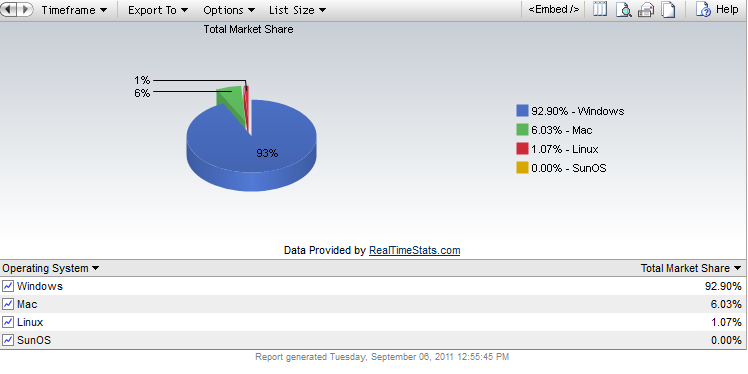

[**حصة Mac OS X من سوق أنظمة تشغيل الأجهزة المكتبية  تتجاوز 6% لأول مرة  في تاريخ إحصاءات Net Applications**](https://www.it-scoop.com/2011/09/os-market-share-net-applications-august-2011)

نشرت Net Applications إحصاءاتها الدورية لحصص مختلف أنظمة تشغيل الأجهزة المكتبية والتي بيّنت [تقدما ملحوظا لنظام Mac OS X](http://www.netmarketshare.com/2011/09/01/Mac-Share-Tops-6-percent-for-the-First-Time-on-the-Desktop) والذي سجل نسبة قُدِّرت بـ 6.03% متجاوزا بذلك حاجز 6% لأول مرة في تاريخ شركة الإحصاءات.

رغم ذلك [لا يزال نظام Windows بمختلف إصداراته محافظا على حصة الأسد](http://www.netmarketshare.com/operating-system-market-share.aspx?qprid=8&qpcustomd=0) والتي تُقدَّر حاليا بـ 92.9%. أما نظام الأسد  Lion فيمثل سدس جميع إصدارات Mac OS X حيث يحوز لمفرده على حصة الأسد 1.03%. في حين لا يراوح نظام Linux على الأجهزة المكتبية مكانه حيث لم يحصل سوى على نسبة 1.07% خلال شهر أغسطس الماضي.

أما فيما يخص نظام Windows  فلا يزال إصدار XP في الطليعة  بنسبة  52.46% مقابل 30.6% لنظام Windows 7. فيما يواصل Vista تراجعه حيث لم تعد تتجاوز حصته 9.4%.
